# Managing Kubernetes Clusters with the Ridge Console
Clicking on Kubernetes in the left side menu brings you to the Clusters page, where you can see a list of any existing Kubernetes clusters. You can then manage existing clusters or add new ones.

# Creating a Cluster
Creating a Kubernetes cluster includes these steps:
  * Setting Cluster Name, Location, and High Availability Requirements
  * Configuring Node Pool
  * Creating Access Tokens

## Setting Cluster Name, Location, and High Availability Requirements
To create a cluster:
1. From the left side menu, click **Kubernetes** and then click **Create Cluster**.
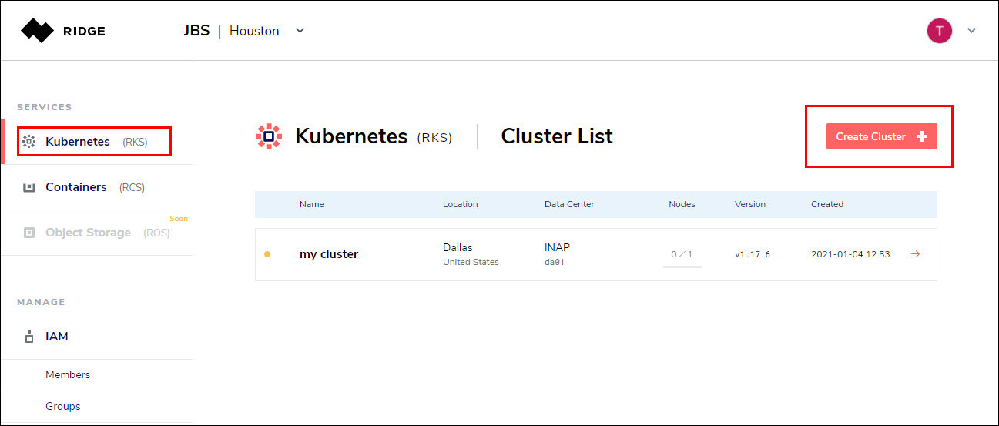
2. Enter **Cluster Name** and **Locations **and select whether your Cluster requires** High Availability** or not. See details of the Cluster parameters below.
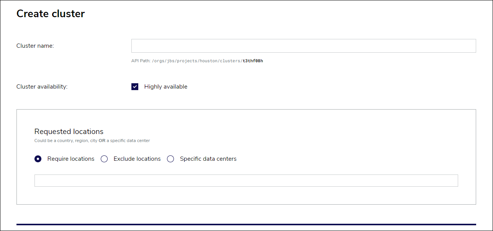
### Cluster Parameters
  * **Cluster Name** - A human-readable name for your cluster. Underneath the cluster name, Ridge also displays the full API path to access the cluster.
  * **Cluster Availability** - If you uncheck this box, the cluster will be created with only one master node, and will not have high availability. By default, high availability is checked, and the cluster is created with three master nodes.
  * **Requested Locations** - You can require or exclude data center locations, filtering by country, region, or city. If you want your cluster created in a specific data center, select **Explicit Resource Pools**, and search for the specific data center where you want to create the cluster.

## Configuring a Node Pool
A **Node Pool** is a group of worker nodes that share identical sizing, labels and taints in Kubernetes.
You can configure a node pool either when you create a new Kubernetes cluster, or from the **Node Pools** tab of an existing cluster.

**Note:** 
You **must** create at least one node pool as part of creating a cluster.

To configure a node pool:
1. On the **Create Cluster** page, scroll to the lower half of the page. Alternately, from the cluster list, select a cluster, then click **Add Node Pool**.
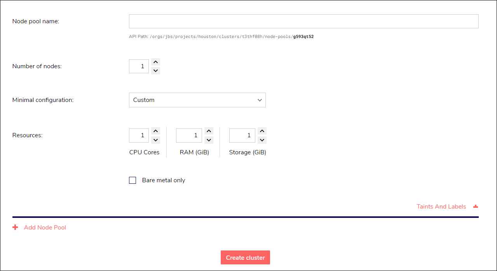
3. Enter **Node Pool Name**, **Number of Nodes**, and select the minimum configuration and resources required by your node pool (see **Node Pool Parameters** below).
4. Optionally add **Taints** and **Labels** to the node pool.
5. Select **Bare Metal Only** if the cluster requires a physical machine.
6. Click **Create Cluster** (or from the New Node Pool page, click **Add Node Pool**). 

### Node Pool Parameters
The parameters you can specify for the node pool are:
  * **Node Pool Name** - A human-readable name for your node pool. As with the cluster name, Ridge displays the full API path to access the node pool underneath the node pool name.
  * **Number of Nodes** - You must have a minimum of one node per node pool. **Required** 
  * **Minimal Configuration** - You can either select a preset configuration for the nodes in the pool, or in the Resources section, you can customize the minimum resources you require for each node.
  * **Resources** - If you prefer to customize the node pool resources, select the minimum number of CPU cores, GiB of RAM, and GiB of ephemeral storage each node requires.
  * **Bare metal only** - Check this box if you require the node pool to use physical machines only.
  * **Taints and Labels** - Ridge supports all of the Kubernetes features, and you can optionally specify initial taints and labels to be added to the node pool.

**Note:**
If the data center cannot provide the exact configuration requested, the actual configuration may be different, however, it will not be less than the minimum specified here.

After you create the Cluster, Ridge begins creating and provisioning. For a highly available cluster, it creates three master nodes, the worker nodes, provisions the machines, network, security rules, and creates a cluster that is fully isolated from the world. You can then access the Cluster and use the Kubernetes API to interact with and deploy applications on top of it.

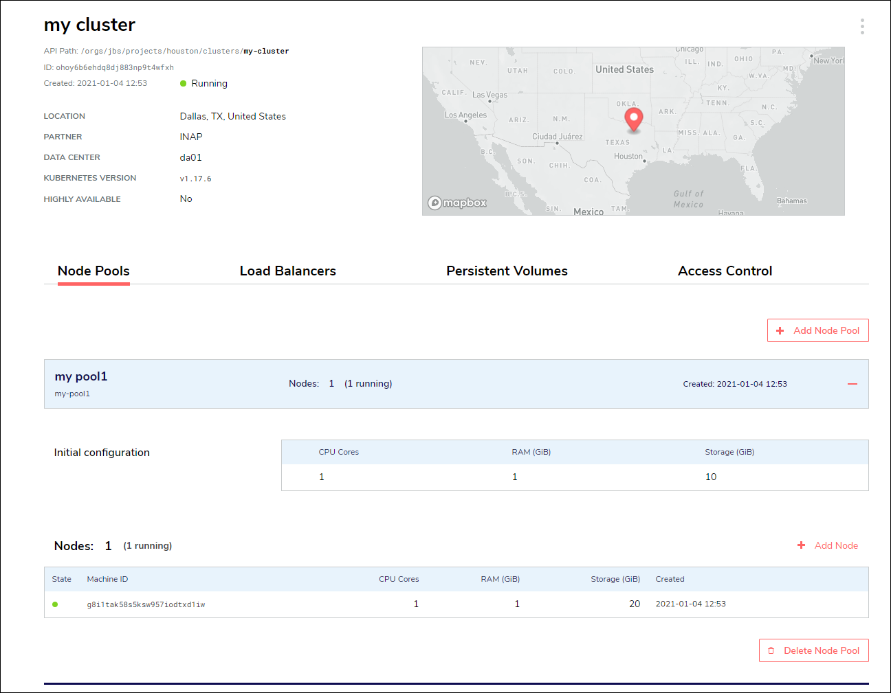
# Creating an Access Token
To access a cluster you need to create an **Access Token**. This creates a token for a single member, that you can use with kubeconfig to set up access to the cluster.

To create an access token:
1. On the Access Control tab of the cluster's main page, click **Add Token**.
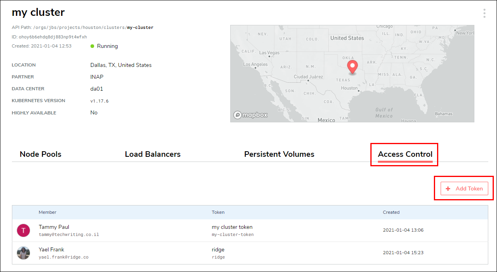
2. Select a member of the organization from the dropdown list.
3. Enter a human-readable display name for the token. As with the cluster and node pool names, Ridge displays the full API path to access the token underneath the token name.
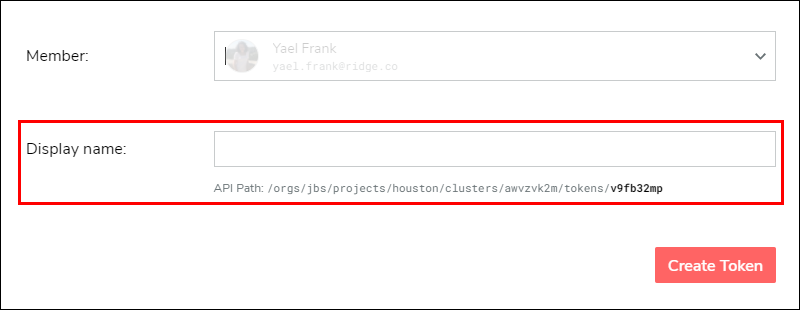
6. Press **Create Token**.

Creating a token generates a Kubernetes configuration file, which you can copy or download.
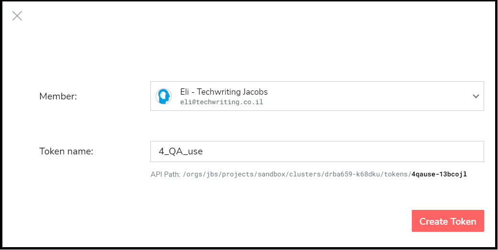

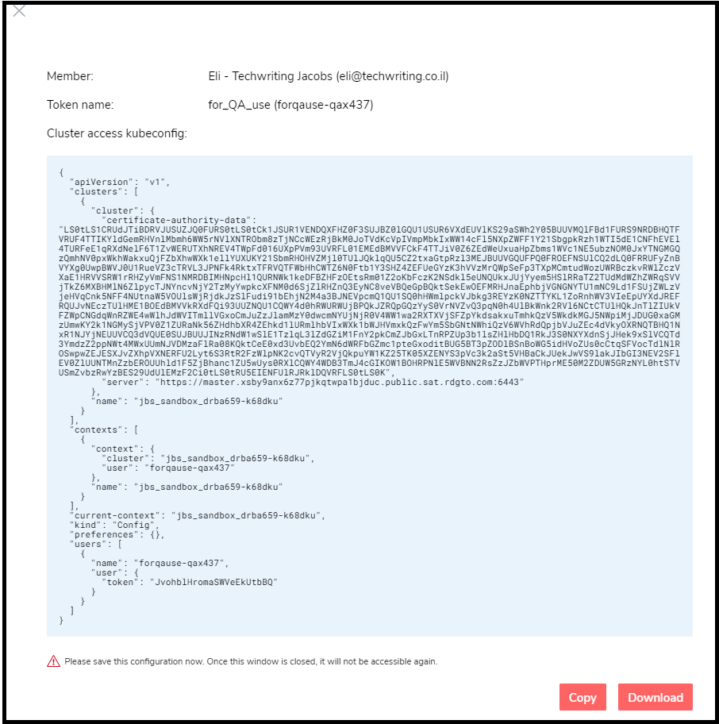

# Revoking a Token
You can revoke a token at any time by clicking the trash can in the UI. A token is also revoked if, for any reason, the member to whom it granted access is deleted from the Identity and Access Management system.

# Viewing Load Balancers
When you define a Kubernetes service whose type is "LoadBalancer" Ridge creates a load balancer in the data center, external to the Cluster.

You can view the cluster's load balancers on the **Load Balancers** tab of the cluster page.
Ridge maintains, provisions, and monitors the load balancer throughout the life of the cluster, as well as configuring its ports and white lists.

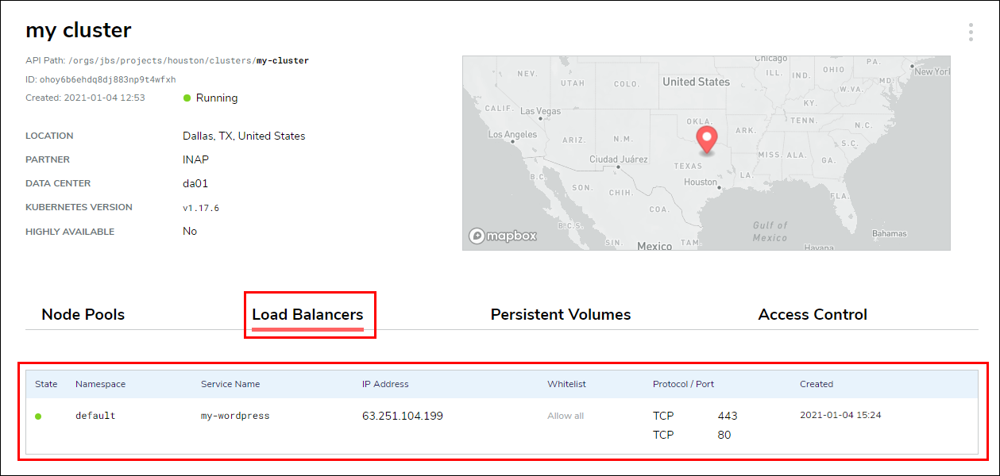
# Persistent Volumes
When you create a workload with a persistent volume claim, Ridge creates a persistent volume. 

You can see the persistent volumes created for the cluster on the **Persistent Volumes** tab of the cluster page in the Ridge console.

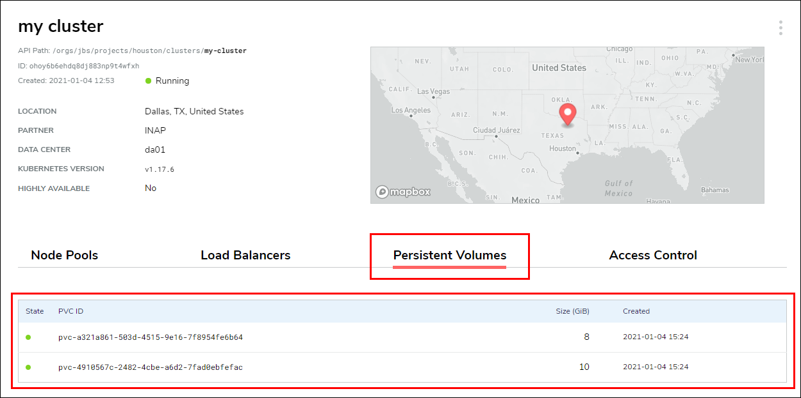

# Deleting a Cluster
To delete a cluster, select **Terminate** from the menu at the top right corner of the cluster's page.
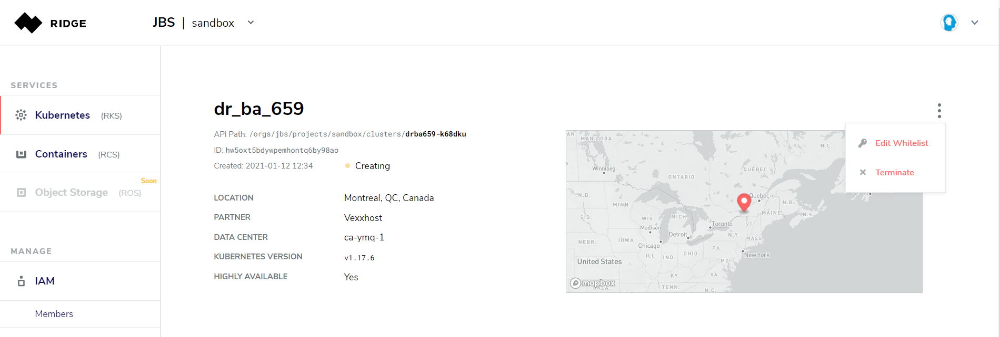

# Deleting or Replacing a Node
To delete a node, select the trash can at the right end of a row.
To replace a node, select the two-arrow icon at the right end of a row.
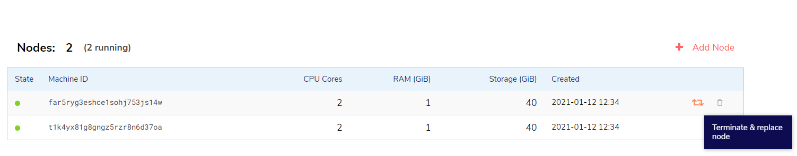

**Note:**
When you replace a node, the current node and its configuration are completely deleted.

# Addding a Node
To add a node, select **Add Node** above the table of Nodes.
