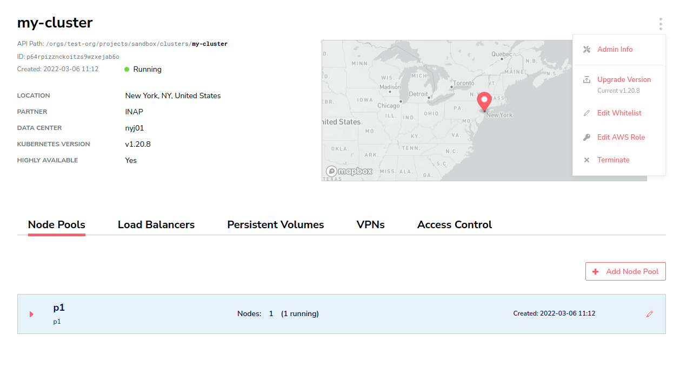
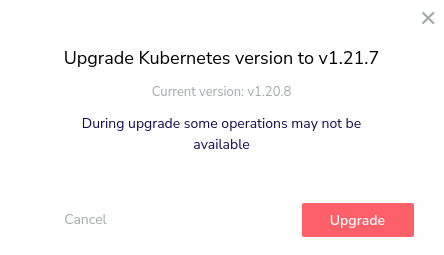
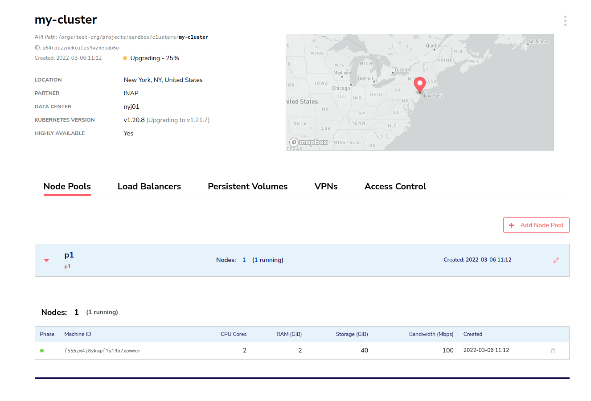

# Upgrading Your Cluster
A cluster can be upgraded form the current version to one new minor version for example from version 1.20 to 1.21
Once the upgrade procedure starts, the system will replace all old version nodes with new ones.
__Notes__
- Only High Available clusters can be upgraded
- Upgrade is performed on one node at a time until all nodes are upgraded, this may take some time depending on the cluster size

## Start an upgrade
Press cluster's settings (3 dots on the right side) and choose _Upgrade Version_. Once you approve, the upgrade procedure will start and cluster will switch to _upgrading_ state

You will be able to view the upgrade status on the main cluster page (how many nodes have been upgrade)

Once all nodes are upgraded, the cluster shall switch back to _running_ state
