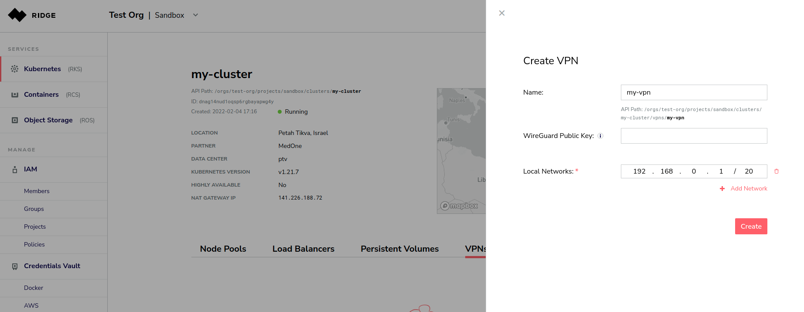
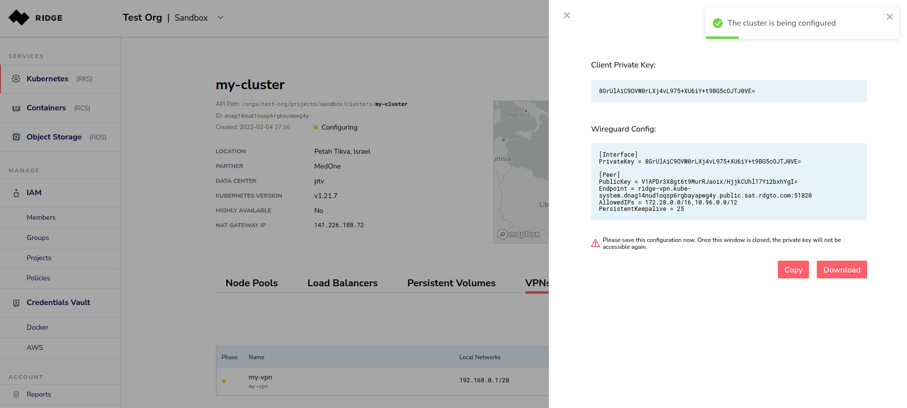
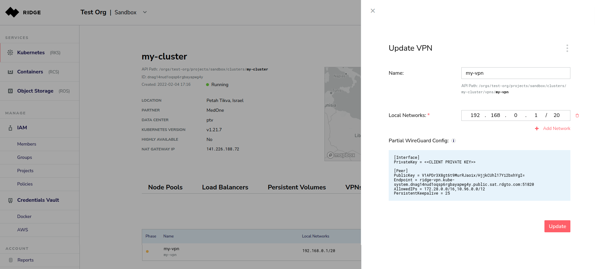

# Cluster VPN
VPN allows secure connections from cluster pods and service to/from an external network based on _WireGuard_ (https://www.wireguard.com).
Ridge automatically takes care of VPN provisioning, so all you need to define is the _local network_ and Ridge does the rest.

This document describes how to create and manage a VPN connection.

**Note:** some locations do not support this feature. you may find an indication of VPN support in the data center list page

## Creating a VPN
On a _running_ cluster choose the VPN tab and press "Add VPN", this will open the VPN pane.


Configure the following properties:
 - Name - the display name of the VPN
 - _WireGuard_ Public Key - you can bring your own key. if left empty, one will be automatically generated
 - Local Networks - the CIDR of the network that you want to connect to the cluster

Press `Create` and Ridge will install and configure the VPN endpoint.
Copy or download the WireGuard configuration. If you manually generated your keys, replace `<<CLIENT PRIVATE KEY>>` by your private key.



## Configure the _WireGuard_ client
- You will need to install _WireGuard_, you can find the installation guide here https://www.wireguard.com/install/
- Save the _WireGuard_ configuration under `/etc/wireguard/wg0.conf`
- Launch the VPN client by running `sudo wg-quick up wg0` and you are good to go

__Notes:__
- Launching the VPN client before VPN is _running_ may cause it to fail
- To verify that the connection is established, run `sudo wg`.
The connection was successfully established if you see under the peer section of your endpoint:
   - latest handshake
   - transfer, where received and sent are higher than 0

   for instance:
    ```
    interface: wg2
    public key: mp4habOWQBfpDHuA7QDIM8G5zUeruf8OhUSjplRFEgk=
    private key: (hidden)
    listening port: 34494

    peer: ir3z2m//ooDV7PDQnssgTilHJKjJ8OGlb9MY5TSfD2o=
    endpoint: 141.226.188.132:51820
    allowed ips: 172.28.0.0/16, 10.96.0.0/12
    latest handshake: 1 second ago
    transfer: 92 B received, 180 B sent
    persistent keepalive: every 25 seconds
    ```

# Configure the VPN
You can always change a running VPN name or local network properties by editing the VPN, click the pencil on your VPN



# Deleting the VPN
On the “Update VPN” page, select Properties → Delete and confirm the deletion.
