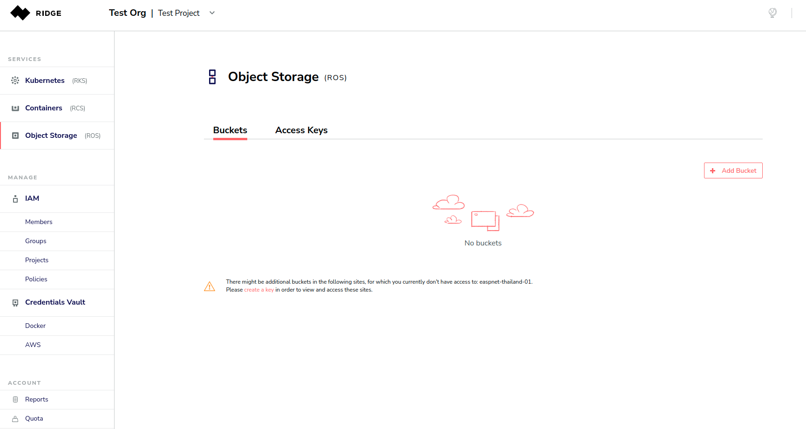
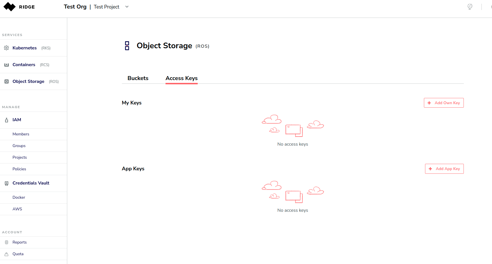
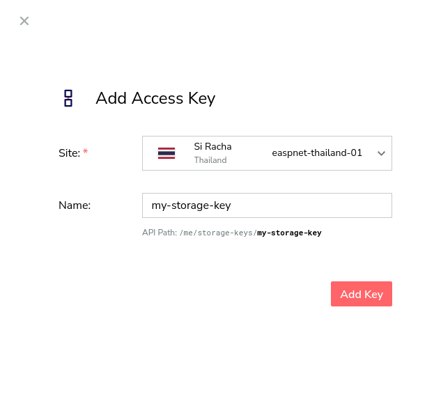
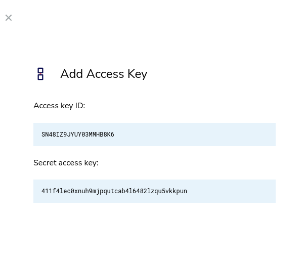
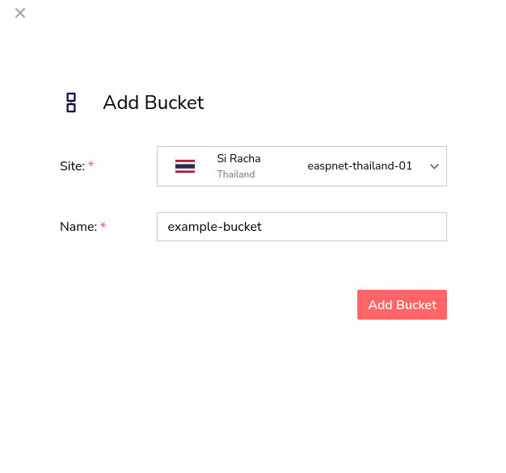
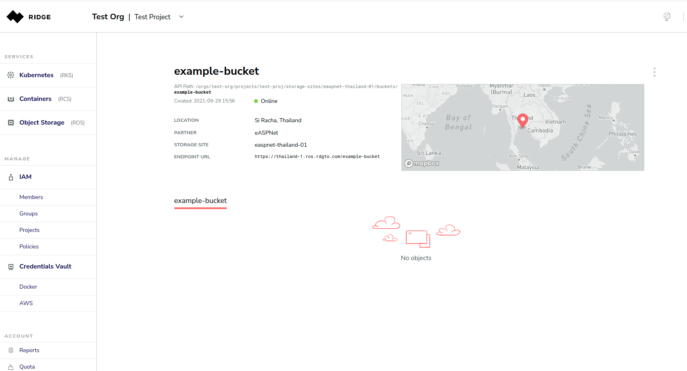
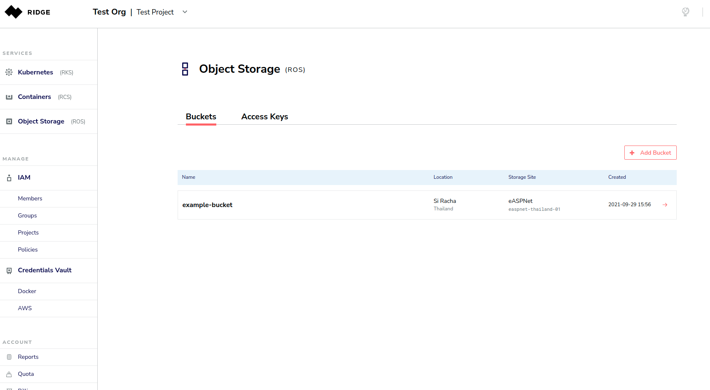
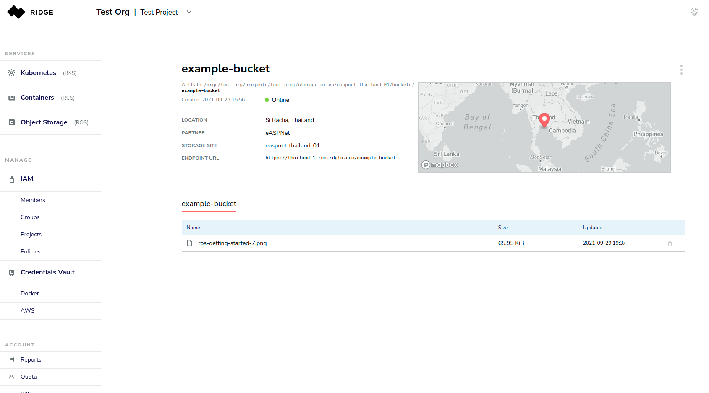
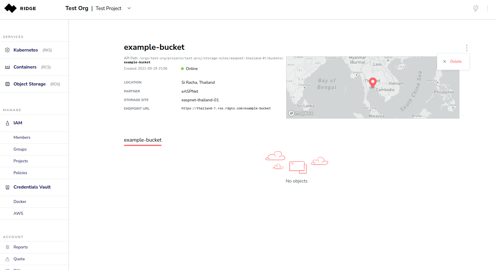

# Using the Ridge Object Storage Service
ROS can be managed with the S3 API. This API requires keyed-HMAC based authentication. This document will explain how to obtain these credentials, how to configure your S3 client and additional management tasks that can be performed from the Ridge console. 

## Obtaining Credentials
Start ny selecting the project in which you wish to use ROS. Selecting **Object Storage** in the left navigation pane opens the object storage page. There are two tabs in this page; one for access keys and one for buckets. In this guide the project is named Test Project. 

Select the **Access Keys** tab. 

Press the **Add Own Key** button to create your first key. Select the ROS site that you wish to access and provide a meaningful name for the key. In this example we create an access key for the ROS site in Si Racha Thailand and name it my-first-storage-key, 

Press the **Add Key** button. A new Pane will appear with the access key ID and secret. Copy these values and use them to configure yur client *see sectio below). 

 

## Managing Buckets in the Console

Navigate to the ROS page and select the **Buckets** tab. This page will show you a list of all the buckets that exist in this project. 

**Note:**
You must have an access key to an ROS site in order to view the buckets of that sire in the console.

Press the **Add Bucket** button. Select the site in which you wish to create the bucket and provide a name for the bucket. In this example we chose the Si Racha Thailand site and named it example-bucket.

After you press the **Add Bucket** button, you will see all the details of the bucket including its endpoint URL.

 

Navigate back to the **Buckets** tab in the ROS pane. The bucket now appears as a row in the table.

 

Press the red arrow on the far right of the bucket's table entry to view the details of the bucket. 

Once you add objects to this bucket (using an S3 client), you will be able to see them at the bottom of the bucket's page. You May delete an object by pressing the trash icon on the far right.

 

To delete the bucket, press the three vertical dots in the upper right corner and select **Delete**.

 

## Configuring an S3 Client
There are only three parameters that you need to configure in your S3 client:

- The endpoint-url. In this example, this should be set to https://thailand-1.ros.rdgto.com
- The aws_access_key_id. This is the ID of your access key
- The aws_secret_access_key. This is the secret of your access key

Note that there is no need to configure the region.