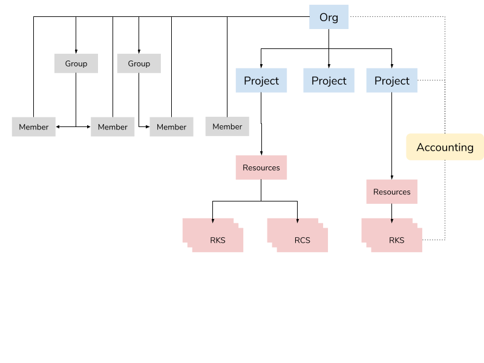

# Identity and Access Management
## Introduction
In this document, we provide an overview of identity and access management (IAM).

The Ridge Cloud is a multi-tenant environment. As such, IAM is crucial for securing your organization’s account. In addition, an organization may want to control who has access to the account and what actions they can take. The IAM service also provides all the means for controlling this.

## Resource Management
Ridge resources are managed by using a hierarchical structure.  Each tenant is represented by an organization and within that organization resources are grouped into projects.

Access can be controlled at both levels of the hierarchy, i.e. the organization and the project. Access may be granted to individual members of the organization or to groups of members.

## Organizations
Organizations (orgs) are the top level of the hierarchy.
The organization provides full visibility of all consumed cloud resources and the ability to segment and manage them.
The organization is also the level at which you manage membership of users and applications (bots).
## Projects
Projects provide the ability to logically group resources within an organization. Consumption of  a Ridge service [Ridge service](https://www.ridge.co) results in allocation of infrastructure resources such as compute, network and storage resources. Every resource you consume from one of the [Ridge locations](https://www.ridge.co/global-infrastructure) is associated with a project.

A project is a convenient construct for managing access control. As an administrator of your organization, you have permissions to create and manage projects. You also control which groups and/or members have permissions to consume and manage services in this project.

## Identity Providers

Ridge makes use of identity providers (IdPs) for user authentication in its console. As a result, Ridge does not deal with passwords or multi-factor authentication (MFA); This is handled by the IdP.
When logging into the console, the user can select which IdP to use. Currently the supported IdPs are Google and Github. The user's authentication procedure will be conducted with the IdP and not with the Ridge cloud.
Ridge relies on the identity provider to authenticate users but has its own authorization mechanism. Once a user is authenticated, he can create API keys for API access.

## Members
Members are entities that belong to an organization. Members can access the API or the web console.
There are two kinds of organization members:
- `Users` that have IdP authentication credentials
- `Apps` that represent applications that need to access the Ridge Cloud API

The organization administrator may invite users to become members. A user who chooses to accept the invitation (received as an email) will need to access the web console and authenticate using one of the supported IdPs. The user will then become an active member of the organization. Applications are created as active members.

## API Keys
Ridge cloud has a RESTful API. Access to this API requires authentication and API keys are the credentials that are used for this authentication. The API keys are placed in the authentication header of the API request and the Ridge Cloud API server uses then to determine and verify the identity of the requester.

API keys can be issued to any member of an organization. In case an API key is compromised,  it must be deleted so that it will no longer be possible to authenticate with it.

## Groups
A group is a an entity that is used to  manage members and permissions.  A member can be assigned to one or more groups.

Groups are the recommended way to manage access control. Rather than configuring the set of permissions for each member, the admin creates groups, that are usually task oriented, and assigns the permissions to the group. When creating a member, the admin need only associate it with the appropriate groups, This makes access management lees error-prone.

Members can be removed from or added to groups at any time. A group can be deleted if it is no longer required and it has no members associated with it.

## Roles and Permissions
An authenticated member is authorized to perform a set of actions that is governed by permissions. Permissions are defined as the combination of a role and a project or organization. For example, a member could be granted a project administrator role in a specific project.

Each role represents a set of actions that the member will be able to execute in the project or orgabization. An administrator hrants permissions to members and hroups. The permissions can be retracted at any time.
Following is a detailed description of roles.

### Project Roles

These roles are granted for a specific project.

#### Project Operator

A project operator can create, delete, view and update the resources in the project.

#### Project Administrator

A project administrator has all the permissions of a project operator. In addition the role allows to:

- Grant and revoke project roles for members and groups in the organization
- Change editable properties of the project
- Delete the project

### Organization roles

These roles apply to an entire organization.

Note that a member of an organization without any organization roles can:

- Leave the organization (cancel own membership), unless the member is the only remaining organization administrator
- View the properties of the organization
- View the list and properties of projects in the organization

#### Organization Operator

An organization operator can:

- Do anything a project operator can do, for any project in the organization.

#### Organization Accountant

An organization accountant can view organization's accounting reports

#### Organization administrator

An organization administrator can:

- Invite users to the organization
- Create applications
- Delete members of the organization
- Create, view and delete API keys of the organization's applications
- Create and delete groups add and remove their members
- Grant and revoke project and organization roles for members and groups in the organization
- Create and delete projects
- Do anything a project administrator can do, for any project in the organization
- Change editable properties of the organization
- Delete the organization
