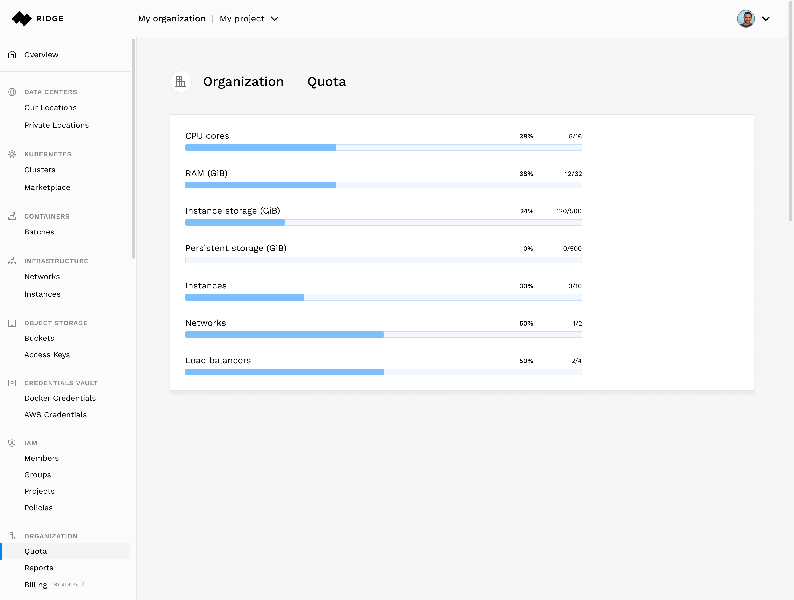



# Ridge Quotas

## General
Ridge manages resources by setting quotas on usage.
If you are planning a significant increase in usage, you can proactively request an adjustment to your quota by opening a support request.

## Checking Your Quota and Usage
At any time, you can view your account quota and your current usage of resources via the Ridge web console or via the Ridge API.

## The Web Console
Select Quota in the sidebar under Account. 

## Quotas and Resource Availability
Resource quotas are the maximum number of resources you are able to create of a specific resource type, assuming the availability of that resource.
Your quotas are not a guarantee that the desired resources will be constantly available.

**Note:** For the purpose of usage calculation, master nodes of a Kubernetes cluster are considered instances.
