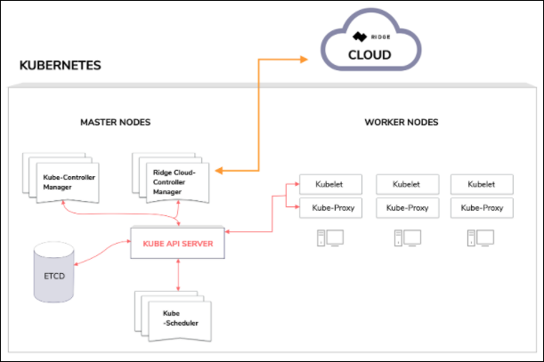
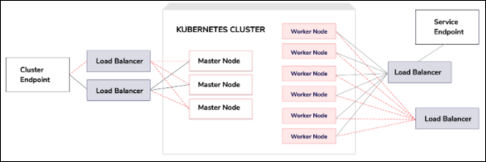

# Ridge Managed Kubernetes Service
## Overview
[Ridge Kubernetes Service](https://www.ridge.co/kubernetes) (RKS) offers a fully certified managed Kubernetes service similar to Google GKE or Amazon EKS.
Using the Ridge tools (Console or API) you define the essential requirements for your Cluster, the heart of a Kubernetes service, and Ridge does the rest. Once your Cluster is set up,  you work with it using standard Kubernetes tools. When needed, you can update the Cluster using Ridge tools.

## What You Define
When you create a Cluster, you define its name and the name of the Node Pool and your requirements. This includes:
  * Kubernetes Version
  * High Availability - required or not
  * Desired/Undesired Locations - (including Conformity requirements) see full explanation below

For the Node Pool, you define:
  * Number of Nodes
  * Minimal Configuration - manual or preset - see more below
  * Bare Metal - required or not

## What Ridge Does
When you define a Cluster, Ridge creates the underlying infrastructure, configures it, installs and provisions the machines to match your requirements. Ridge's managed service monitors the Cluster and its infrastructure to assure availability as defined.

After the Cluster is created, you will see:
  * Cluster ID
  * Cluster status
  * Kubernetes version
  * High availability state
  * Node Pool and Node configuration

## Accessing the Cluster
Once the Cluster is active you can assign access permissions to a member of your organization by creating an access token. Access can be revoked at any time.
You can use whitelisting to further control access (for authorized members) based on a range of IP addresses.

## Working with Your Cluster
After creating a cluster and assigning access rights, you interact with your cluster using standard Kubernetes tools. You only return to Ridge tools (i.e., the API or Console) if you need to update the Cluster.

## What You Can Update
After your Cluster has been created, you can:
  * Delete the Cluster
  * View Resources (Load Balancers and Persistent Volumes) created by Ridge based on your applications
  * Change Kubernetes version
  * Scale Up or Down (Add or Remove Node Pool)
  * Add Nodes to Node Pools

## Data Center Location and Conformity Requirements
The [Ridge Cloud](https://www.ridge.co) is a collection of Data Centers located all over the world. When you create a Cluster, you may list desired or undesired locations (such as countries, states, cities, or specific Data Centers). For example, you may want a cluster in any Data Center in California; not in a specific country; or you may want to require the cluster to be at a *specific *Data Center.

Rather than defining desired/undesired locations, you can also define a requirement for a Data Center that is compliant with a specific industry standard, such as SOC2, ISO or HIPAA and Ridge will base its choice of location on that requirement.

## Node Pool Configuration
When you define the configuration required for a node pool, you indicate:
  * Number of Nodes
  * Number of CPU Cores
  * RAM (GiB)
  * Storage (GiB)
  * Bare Metal - required or not
  * Kubernetes labels
  * Kubernetes taints

Alternatively, you may choose a preset configuration expressed in sizes from X-Small to XX-Large.
Each preset includes definitions for number of CPU Core, and amounts of RAM and storage.


## Cluster Provisioning  - What's Under the Hood?
The Ridge Allocation Engine chooses the best suited Data Center and creates the cluster by provisioning the machines, installing and configuring them. The choice that it makes is based on the requirements defined.
If the resources required for your exact configuration are not available, Ridge will create an alternative configuration that may be greater than the requirements, but never less.

## Cluster Monitoring and Auto-healing
Once the cluster is up, Ridge will monitor it 24/7 to make sure it is fully operational. If a malfunction or failure occurs, Ridge will activate the cluster’s auto-healing mechanism and try to reach a stable state again by ensuring the control plane (master nodes) and worker nodes are all running and healthy.
If Ridge identifies an unhealthy node by monitoring the state in the cluster, the system will create another node instead, provision, and configure the node so that eventually it will join the cluster and Kubernetes will become stable again.

**Notes:**
- The auto-healing process requires no user intervention and, in most cases, the user will not realize a problem has occurred
- When creating a cluster with high availability, the cluster control plane has three master nodes, therefore a failure of up to 2 master nodes will have no impact on the cluster’s operation.


## Load Balancers

A Ridge Kubernetes cluster is composed of a highly available control plane that consists of three master nodes and a highly available load-balancer, created outside the cluster, that directs the user’s management traffic to the master nodes (to allow users to interact with Kubernetes API). The address of this load balancer is the endpoint of the cluster - provided to the user by the Ridge API or console.
You can also request external load balancers from within the Kubernetes cluster by creating services of type **LoadBalancer**.

Similar to other managed Kubernetes solutions, each Ridge cluster is installed with a Ridge Cloud-controller component that monitors for internal Kubernetes state changes and interacts with the Ridge Cloud to reconcile to the desired state, such that when a user makes a load balancer request, Ridge can handle and provide the load balancer.


### Basic Load Balancer Flow
When you create a service of type “LoadBalancer” on the cluster, Ridge’s Cloud Controller will attempt to fulfill this request by sending the Ridge Cloud a request to create (and also modify and delete) a load balancer. The Ridge Cloud will create and configure a load balancer in the relevant Data Center, and will send the cloud-provider the IP address that was allocated, which in turn sends it to Kubernetes.
Note, this entire process is done in a seamless, transparent manner. You only need to define the desired state.
You can see the state of the load balancer via Ridge API or Console.
When a cluster is deleted, any associated load balancers are also deleted.
Load balancers may incur additional fees as they consume a routable IP and compute resources.

You manage load balancing services via the Kubernetes API.



## Persistent Storage
RKS supports Persistent Volumes (PV) in all Data Centers that offer block storage. Each cluster is configured with storage classes which represent the block storage types that are available for consumption as PVs in the specific Data Center.
Ridge configures Kubernetes to use Ridge’s CSI as its storage interface, the CSI drivers are seamlessly installed on each cluster so that the experience to developers is transparent.

### Basic Persistent Storage Flow
When the developer creates a Persistent Volume Claim (PVC), Ridge CSI interacts with the cluster to retrieve the desired configuration as requested by the user and sends Ridge Cloud a request to fulfill the desired claim. Ridge Cloud will create a volume in the Data Center and attach it to the desired node. Once the volume is attached to the node, Ridge CSI drivers will take care of mounting and formatting the requested volumes to the pod - all seamless to the user.
Like all resources in the system, the user will be charged for the volume that is created until the volume is deleted.
The user only needs to manage PVCs via the Kubernetes API. **All the rest takes place automatically.**

## Scaling Node Pools Up/Down
When you scale-down a Node Pool, by deleting a Node, the number of worker nodes is reduced by 1.
You should indicate the Node which will have the least impact on running processes.
Ridge uses a safe drain approach: at first Kubernetes is told not to add any new pods to the Node, and then the existing pods are moved to other available Nodes, one at a time.
You can scale up a Node Pool, by adding a Node. After its creation, pods will be deployed on the new Node.

**Note:**
Deleting a specific node from the pool, without changing the desired amount in the pool, will trigger the creation of a new node (Ridge will try to reconcile to a stable desired state as determined by the developer).

## AWS Credentials for Containers
Containers that run in your cluster may need access to AWS services. For example, the containers may need to write data to S3. These containers need AWS credentials for this purpose. Placing these credentials in the container image is not secure and configuring each container is complex and inconvenient.
Ridge stores AWS credentials for you, in a secure, reusable manner and uses them to generate temporary credentials for containers. The AWS SDK that you install in your container will automatically locate these credentials. The Ridge implementation makes the AWS credentials available in the same manner that AWS does.
### Basic Flow
The first step is to store AWS credentials on Ridge Cloud.  See [External Credentials API](https://dev.ridge.co/api/keyring/overview/).
You will need to specify yhe following parameters:
  - AWS region
  - Access key ID
  - Access key secret
  - Name for these credentials
These credentials must allow for creating temporary AWS credentials (using AWS STS service API).

When you create a cluster you can choose to make **temporary** AWS credentials available to the containers that will run on the cluster. To do this you will beed to specify:
  - The identifier of the above mentioned AWS credentials, referenced by name
  - The ARN of the role that you wish the containers to assume
  
A container that will run in this cluster can make use of the AWS SDK. This SDK will search for the credentials on the metadata server (169.254.169.254). The metadata server is part of the managed Kubernetes service and Ridge Cloud will make **temporary** AWS credentials available on it for the specified role.

## Metadata Service
All containers that run on a Kubernetes cluster have access to Ridge Cloud metadata.

The metadata includes the following information:
- Data center information. The name, ID, and path (in the Ridge API) of the data center in which the container is running.
- Organization abd project information. The name, ID, and path (in the Ridge API) of the organization and project to which the container belongs.
- The name, ID and path of the cluster in which the container is running.
- The node ID. The ID of the worker node on which the container is running. The ID's prefix is the name of the node pool to which the worker node belongs. For example pool1-bfnmngg41jh7di69konzr3pt9o


To obtain all the metadata issue a GET request to `https://169.254.169.254/v1`. The response will be in JSON format:


```
{
  "data_center_id": "{data-center-id}",
  "data_center_name": "{data-center}",
  "data_center_path": "/partners/{partner}/data-centers/{data-center}",
  "org_id": "{org-id}",
  "org_name": "{org}",
  "org_path": "/orgs/{org}",
  "project_id": "{project-id}",
  "project_name": "{project}",
  "project_path": "/orgs/{org}/projects/{project}",
  "cluster_id": "{cluster-id}",
  "cluster_name": "{cluster}",
  "cluster_path": "/orgs/{org}/projects/{project}/clusters/{cluster}",
  "node_id": "{node-id}",
}
```
To retrieve a specific parameter in text format, append its name to the path. For example,  `https://169.254.169.254/v1/data-center-id` returns the data center ID in plaintext. 