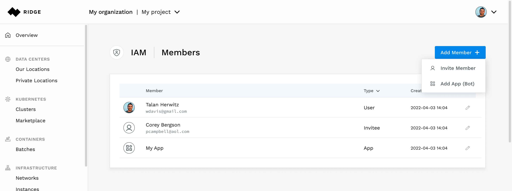
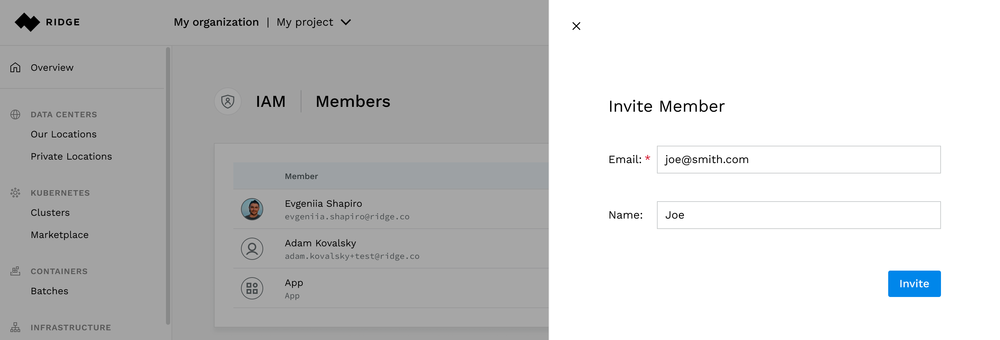
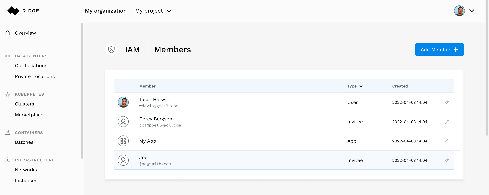
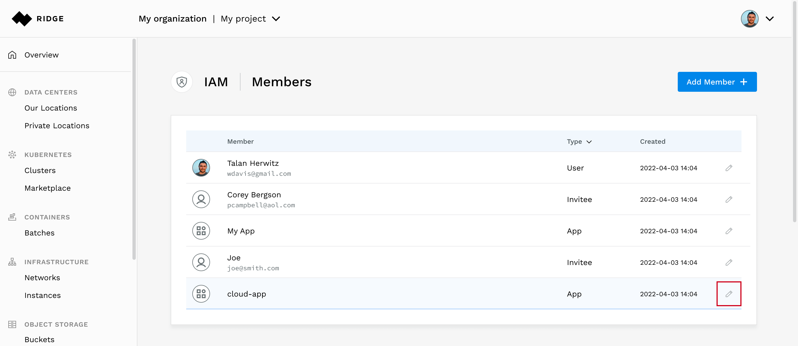
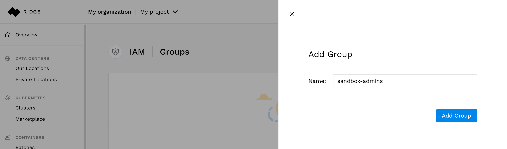
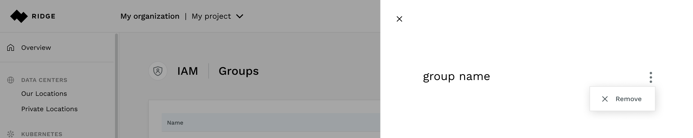
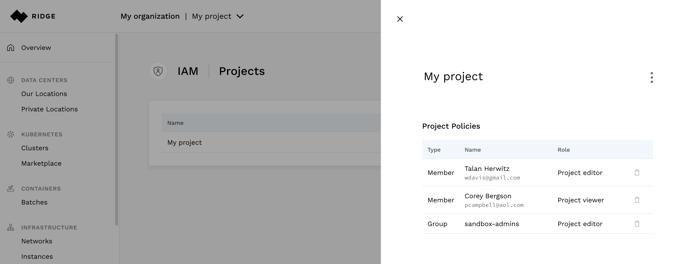

# Getting Started with Identity and Access Management

## Overview
This is a guide that will walk you through some basic use cases of identity and access management (IAM) in Ridge Cloud. See [IAM overview](../../docs/iam/iam-overview.md).
In this guide we will walk you through the following tasks:
- Creating a project
- Inviting users to become members
- Managing applications as members
- Creating a group, assigning it privileges and managing its members
- Assigning privileges to members

## Prerequisites
To activate your membership in your organization, follow the link you received in the invitation email from Ridge.

This guide assumes you have been granted the organization administrator role.
You will not be able to perform the actions described in this guide without these privileges.

## Creating a Project

All services that you consume from the Ridge Cloud are created as part of a project. To view the projects in your organization, select the Projects menu item in the navigation bar located under the IAM section.

Use the Add Project button to create a new project. In this example we name the ne project test.

At this stage, you can start using [Ridge Cloud services](https://www.ridge.co).

## Inviting a Member
There are two prerequisites to add a person as a member of you organization
- You must have the person's email address
- The person can be authenticated using Google or Github
Select the Members item in the IAM section of the side navigation bar.
Click the Add Member button on top right

Provide a name and an email address. In this example the member was named Joe and his email set to joe@smith.com.

You will then see the new member of type invitee. This will change to user when Joe accepts the invitation.

### Creating an API Key
Access to the Ridge Cloud API requires an API key. Once the user accepts the invitation, he can generate a key for himself. To create the key, select your avatar in the upper right hand corner to. This will drop down a menu where you can select the `API Keys`.

Enter a name for the key. The name will help you identify the key, as the key itself will not be visible at a later time. In this example the key is named Key 1.

Copy the API key and save it.

## Allowing Applications to Access the API
You can create an application that can access the Ridge Cloud API by creating a member of type `app`, granting it permissions and generating an API fey for it. In this example we create an application named  cloud-app.

Start from the members view, click the `Add member` button and select the `Add app` item from the menu.

### Create an API key for an Application
From the members list, select the pencil sign for cloud-app

In the edit pane, press the add API key and create an API key named app-key

The key will appear. You must copy it as it will never be shown again.

## Managing Groups
Groups are used to simplify access management. As an organization administrator, you can create a group, define its privileges and associate members with it. These members will inherit all the privileges of the group. In this example we will create a group with privileges to manage a project named Sandbox.

We start by selecting the Groups item in the left navigation bar and press the Add Group button.

Name the group **sandbox-admins**.

From the group list choose to edit the **sandbox-admins group**. Select the Project-editor privilege in the Sandbox project.

Now any member that will be added to the group will have project editor privileges in the Sandbox project.

### Adding a Member
Next we will add a member to this group. In the editing pane of the group, you can select the members from the list of organization members. In this example we add a member named Cloud-App

You may modify the members and privileges of the group using the edit pane of the group.

To delete the group select the vertical ellipsis sign at the top right hand of the editing pane. This will expose the Remove item. electing it will issue a question to verify that you are sure that you wish to delete the group.

## Granting Privileges to a Member
Privileges may be assigned to individual members (in addition to groups). From the members list press the edit icon of the member. In this example we will add the Project editor role to the member named Joe in the Sandbox project.

You can add additional roles in multiple projects and at the organization level.
To remove the privilege, simply uncheck the box.

To view all the access policies related to the Sandbox project, select it from the Projects list. You will then see the groups and individual members who have roles in it.

