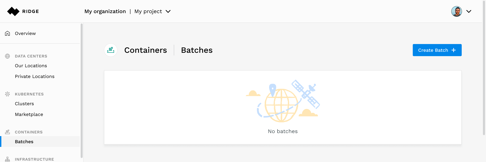
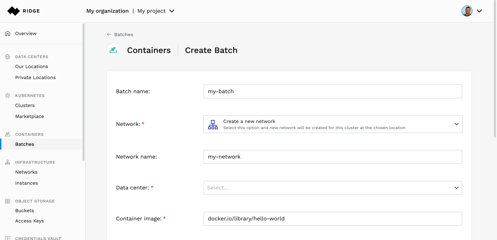
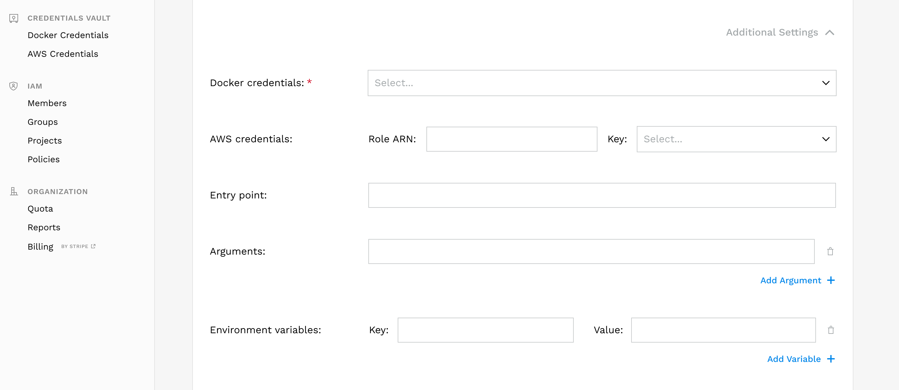
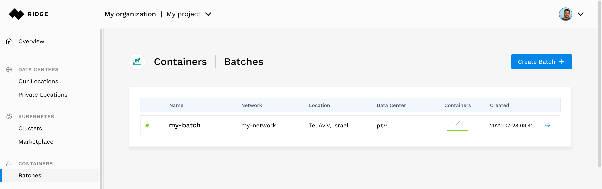
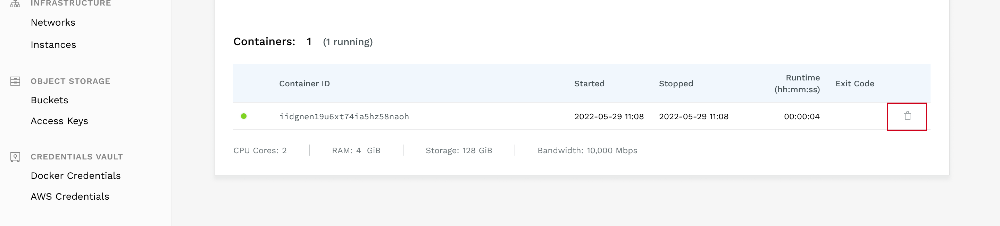

# Managing Containers with the Ridge Console
Clicking on **Containers &#8702;  Batches** in the left navigation pane opens the Containers page, where you can see a list of any existing batches of containers. You can manage existing batches or add new ones.

## Creating a Batch
To create a batch:
- From the left side menu, click **Containers** and then click **Create Batch**.

- Configure the following properties:
  - **Batch Name** (display name can be changed after creation)
  - **Network** - select an existing network or create a new one

    **Note**: Networks are isolated. Batches created in different networks cannot connect to each other's private addresses. You can create multiple batches on the same network.
    If you select to create and new network, choose a **Data center** in which you want your cluster to run. For more information about the available data centers, click the Data Centers section.

    In this example we chose to create a new network in a data center located in Dallas
  - **Container image** - the full path of the image

      For example (using DockerHub) - `docker.io/library/hello-world:latest`
      **Note**: You can configure private registry credentials using the credentials vault
  - **Elasticsearch Endpoint** - Ridge will collect logs from all containers in the Batch and ship them to this endpoint

  - **Number of containers** - the number of containers to run. each container will run on a dedicated machine.
  - **Configuration** - the machine configuration that will run the container

### Setting Optional Parameters
When you create a batch, you have the option of defining:
  * **Docker Credentials** - in case you are using a private registry, select the key as entered in _Credentails Vault_
  * **AWS Credentials** - Applications deployed on a container, can continue to use any AWS service, with no extra configuration.
This allows you to deploy applications that use AWS SDK without the need to handle complicated permission configuration - Ridge dynamically takes care of that.

    In order to use this feature, you need to:
    - Create and store a one-time AWS credentials using Ridge credentials vault.
      Select the **Credentials Vault** -> **AWS** to manage AWS credentials. Ridge can use these to create temporary credentials for your containers. The AWS SDK that you install in your container will automatically locate these credentials. This will allow your containers to seamlessly access AWS services.

    - provide AWS credentials to the containers in you cluster click **Additional Settings**. In the **AWS credentials** section set the following:
        - Enter the ARN of the role that you wish the containers to assume in the **Role ARN**
        - Select the AWS credentials to use for obtaining the temporary credentials from the dropdown list in the **key** parameter.

  * **Entry Point**
  * **Arguments**
  * **Environment Variables** (as key-value pairs)

Click **Create Batch**.

While Ridge is spinning up the batch, the status will appear as *Creating*, the container details will indicate *Queued* and a gray indicator will appear next to the Batch in the Batch list.

A container will be created and will run. in case a container exits, an exit code will be displayed.

# Viewing Batches
After you create a batch, Ridge displays all the information of the newly created batch.
A list of batches and their key details, appears on the **Containers** page.

# Deleting a Container in a Batch
To delete a container:
1. Select a Batch.
2. Click the Delete button at the right end of the container you want to delete.

# Deleting a Batch
To delete a batch:
1. Select a batch.
2. From the top right, select **Delete**.

