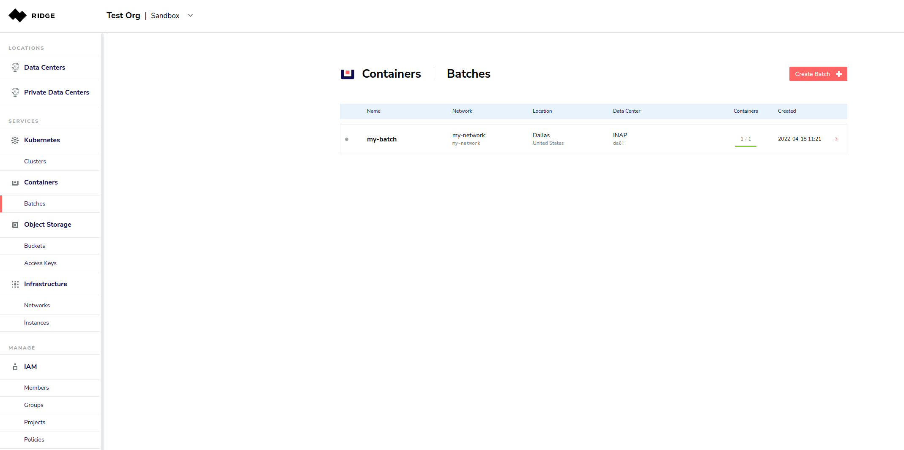
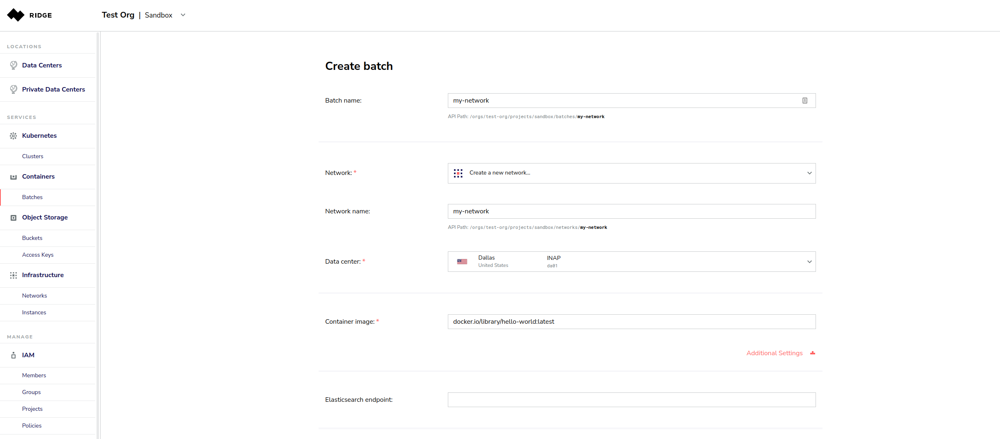
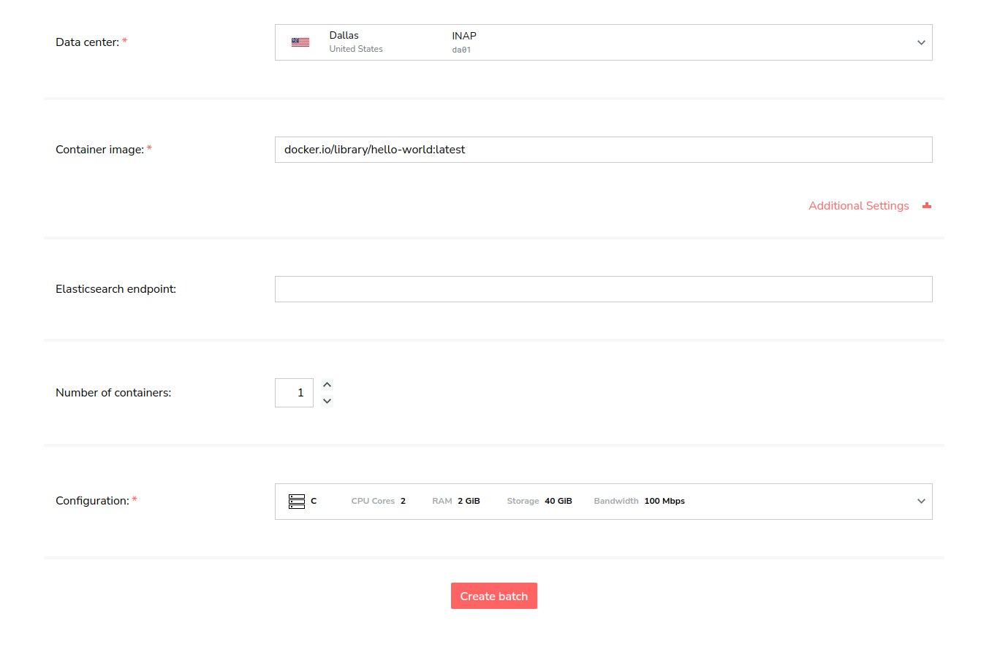
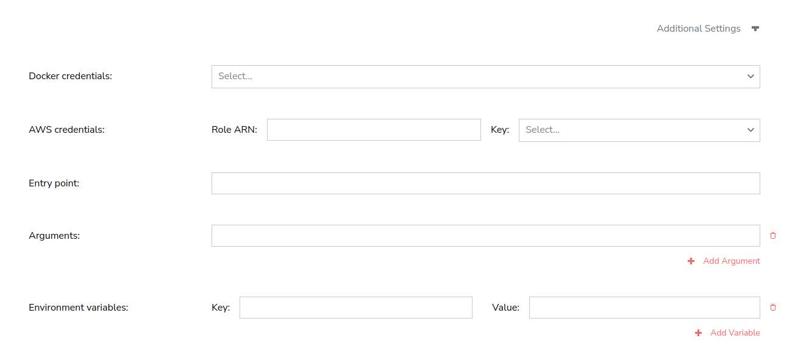
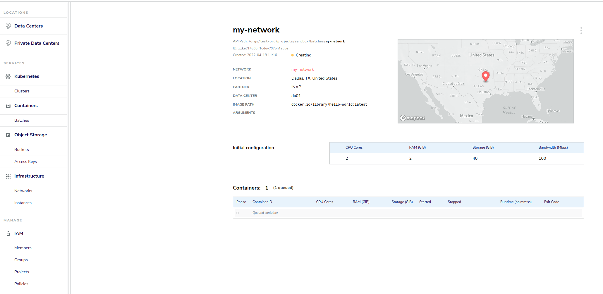
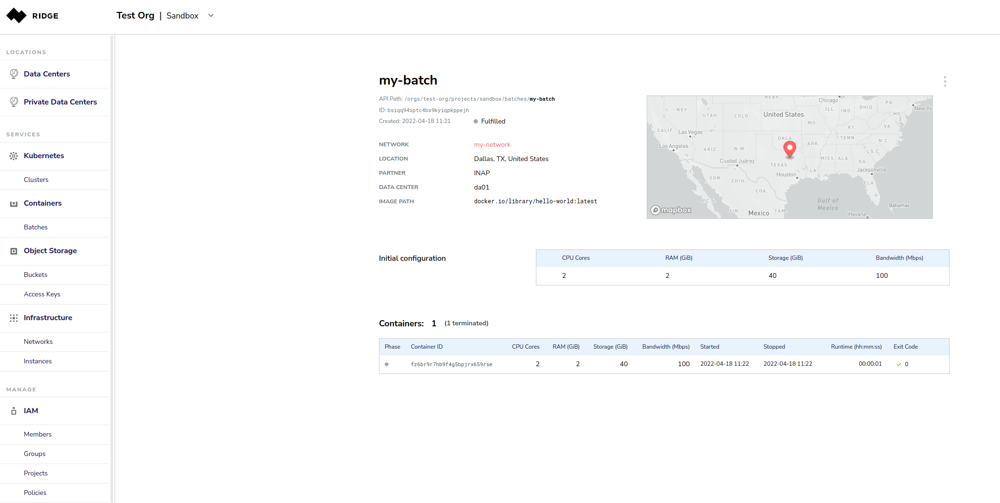
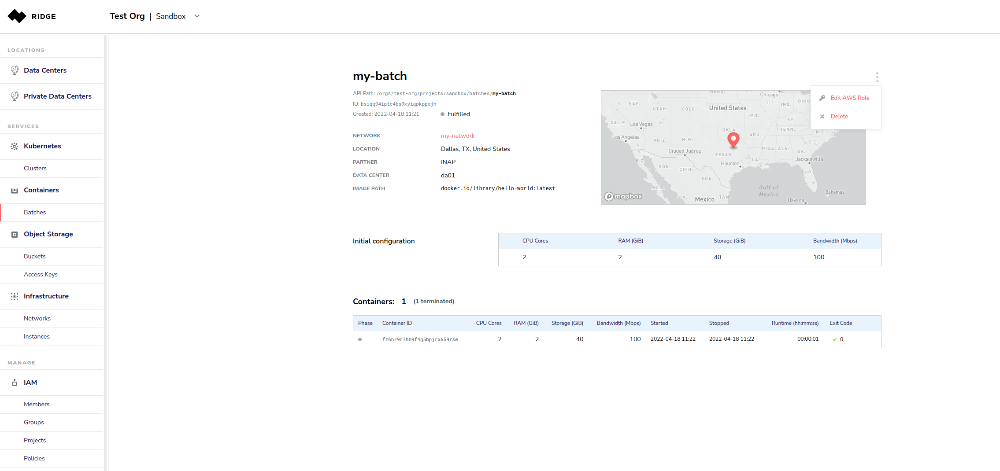

# Managing Containers with the Ridge Console
Clicking on **Containers** in the left navigation pane opens the Containers page, where you can see a list of any existing batches of containers. You can manage existing batches or add new ones.

# Creating a Batch
Creating a batch includes these steps:
  * Part A - Setting Batch Name and Container image
  * Part B - Setting Optional Parameters
  * Part C - Configuring Container(s)

## Part A: Setting Batch Name, Container Image
To create a batch:
1. From the left side menu, click **Containers** and then click **Create Batch**.

2. Enter **Batch Name** and **Container Image**; see details in the table below.

### Batch Parameters

  * **Batch Name** - A unique name for your batch. Note that the API path to access the batch appears below the name.
Example - `my_batch`
  * **Container Image** - **Required.** The path of the Docker repository where the container image can be found.
Example - `docker.io/library/hello-world:latest`

## Part B: Setting Optional Parameters
When you create a batch, you have the option of defining:
  * **Entry Point**
  * **Arguments**
  * **Environment Variables** (as key-value pairs)
  * **Elasticsearch Endpoint**

## Part C: Configuring a Container
When you create a batch, you must also configure at least one container.

To configure a container:
1. On the **Create Batch** page, scroll to the lower half of the page and enter the number of containers.

2. Either:
    a) Select a specific data center and then select a preset container configuration.

or
     b) Select one or more desired locations and set the minimum configuration for the container (CPU      cores, RAM and Storage).

3. Click **Create Batch**. 
While Ridge is spinning up the batch, the status will appear as *Creating*, the container details will indicate *Queued* and a gray indicator will appear next to the Batch in the Batch list.

**Note:**
If the data center does not have the exact configuration requested, the actual configuration may be different, however, it **will not be less** than the minimum specified in your configuration.

# Viewing Batches
After you create a batch, Ridge displays all the information of the newly created batch. 
A list of batches and their key details, appears on the **Containers** page.

# Updating Batch Name
To rename a batch:
1. Select the batch you want to rename.
2. Select the batch name and press the **Edit** icon.
3. Enter a new name for the batch, then press **Enter**.

# Copying Batch's Path or ID
To copy the API path or batch ID:
1. Select a batch.
2. Hover over the API path or batch ID.
2. Click the API path or batch ID.

# Deleting a Batch
To delete a batch:
1. Select a batch.
2. From the top right, select **Delete**.

# Deleting a Container
To delete a container:
1. Select a batch.
2. Click the Delete button at the right end of the container you want to delete.

