# Creating a Cluster
Creating a Kubernetes cluster includes three main steps:
* Setting Cluster basic configuration such as name, location, version and High Availability Requirements
* Configuring Node Pool(s)
* Accessing the cluster

From the **Navigation** pane, click **Kubernetes** and then click **Create Cluster**.
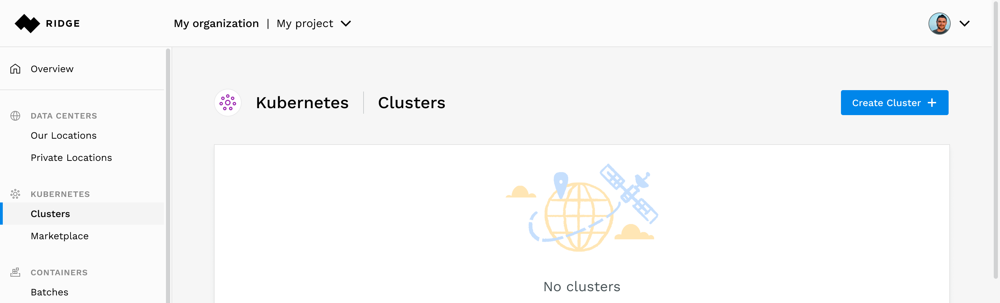

## Setting Cluster Parameters

- Set the **Cluster Name**. In this example we set it to _my-cluster_
- Network:
  - Select an existing network or create a new one

  **Note**: Networks are isolated. Clusters created in different networks cannot connect to each other's private addresses. You can create multiple clusters on the same network
   - If you select to create and new network, choose a **Data center** in which you want your cluster to run. For more information about the available data centers, click the Data Centers section.
- High Availability configuration - selecting **High Availability** (default), will create three master nodes. you may uncheck this in cases you do not require HA (such as development or QA purposes)
- Select a **Kubernetes version** from the drop-down list. The latest supported version is selected by default

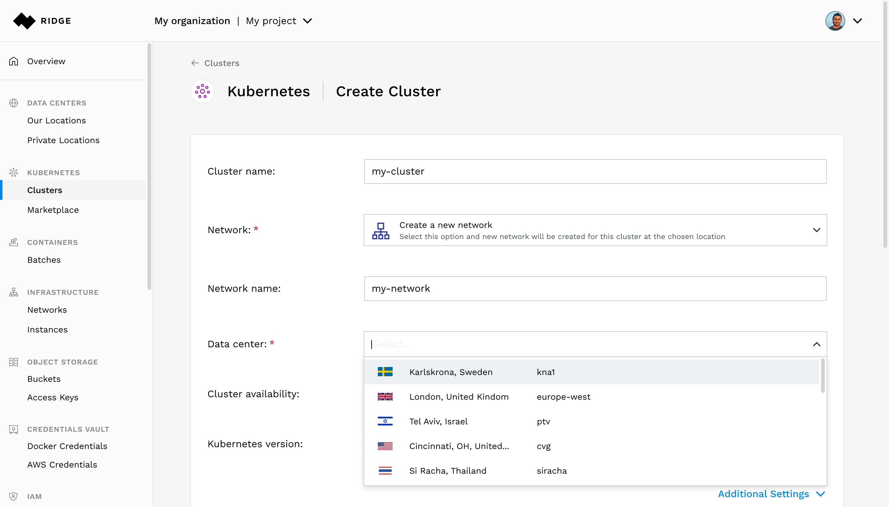

## Creating a Node Pool
A **Node Pool** is a group of worker nodes that share a common configuration such as sizing, auto-scaling, labels and taints.

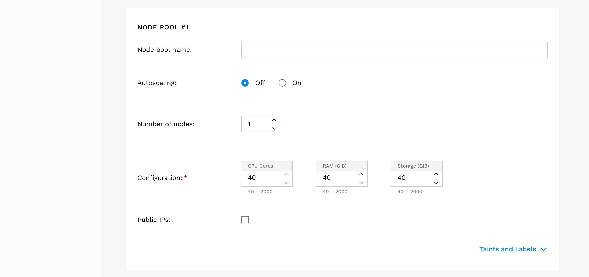

- Enter a **Node pool name**. On this example we use _pool1_.
- Selecting autoscaling will dynamically adjust the size of a node pool in accordance with demand from the cluster.
  if you enable autoscaling, you will need to specify:
  * **Minimum nodes**: determines the smallest size of the pool
  * **Maximum nodes**: determines the largest size of the pool
  * **Initial Count**: determines the size of the pool at its creation
    

- In this example we disable **Autoscaling** and set the **Number of nodes** in the node pool to 1
  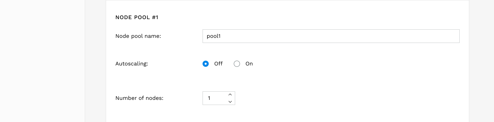
- Select a **Configuration** for the nodes in the pool. Data center may have different configuration options:
    * Catalog of preset configurations, similar to instance types
      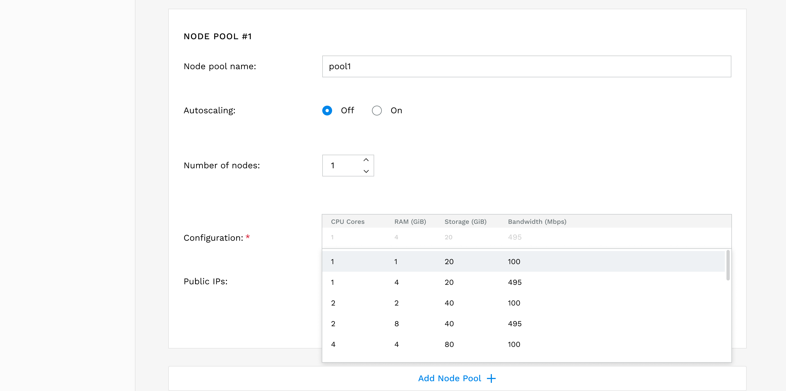
    * Customizable instances - allows flexible configuration of CPU cores, RAM and storage.

      **Note:** If the data center cannot provide the exact configuration requested, the actual configuration may be different, however, it will not be less than the minimum specified here.
      
 **Note:** If you have exceeded your quota, a warning message is displayed.

Click **Create Cluster**
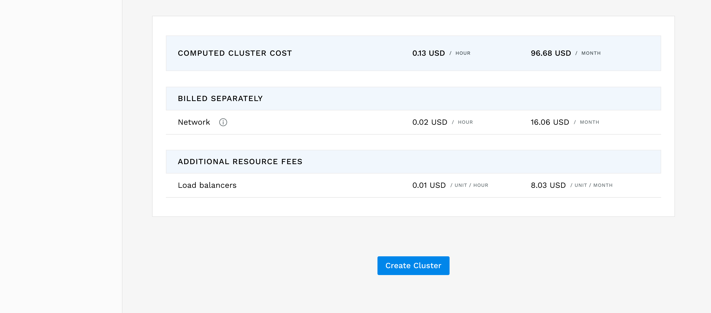
After you create the Cluster, Ridge begins creating and provisioning. It creates master node(s), worker nodes, provisions the machines, network and security rules.  The cluster it creates  is fully isolated from the world. Once the cluster is in the `running` state, You can use the Kubernetes API to interact with and deploy applications on top of it.

## Accessing the cluster
To access a cluster using standard Kubernetes API tools such as `kubectl`, you need to create an **Access Token**.
Creating an access token grants a member of the Organization credentials to Kubernetes API.

**To create an access token:**
1. Go to the **Cluster** page and select the **Access Control** tab.
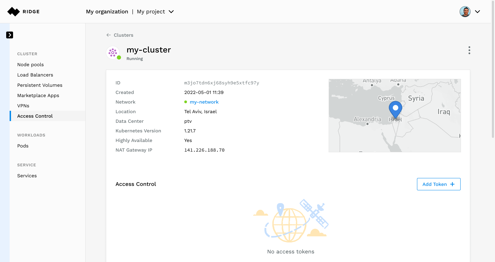
2. Click **Add Token**.
3. Select a member of the organization from the dropdown list.
4. Enter a **Token name**.
5. In **Groups**, enter a role binding associated with this token.
   The group name should always match a group that appears in Kubernetes role bindings that are defined in your cluster.
   In this example, this is the first user of the cluster, therefore we assign the `system:masters` group.
6. Click **Create**.
    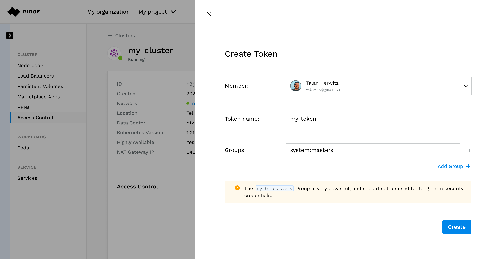

A standard Kubernetes configuration file is generated, now you can securely use any Kubernetes tools to interact with the cluster.
Download the Kubernetes config file and save it under your `.kube` folder or export `KUBECONFIG=<name of your config file>`, so you can point your kubectl to the cluster you just created.
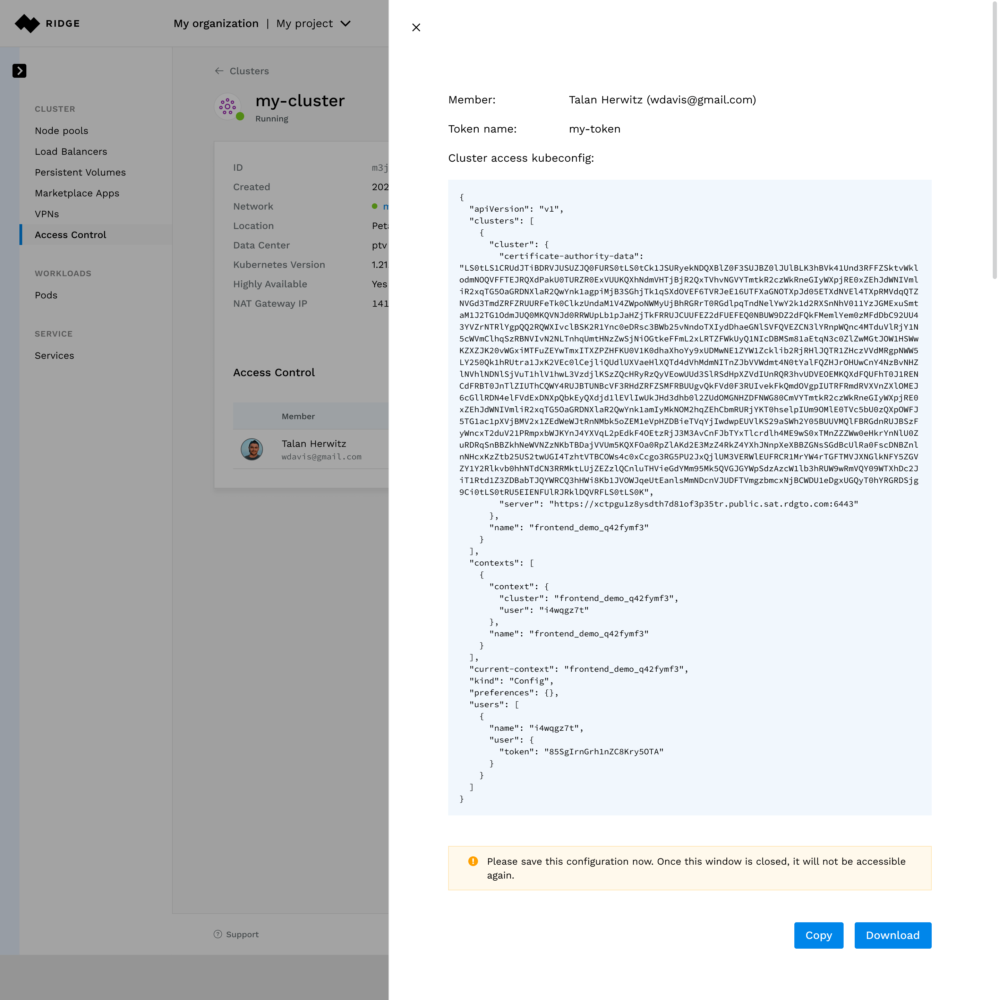

## Advanced Configuration Options
In addition to the basic configuration, Ridge offers additional useful options.
## Cluster API Whitelist
Your cluster is created, by default, With a Kubernetes API server that can be accessed from any IP address. If you wish to limit this access or block it altogether, click **Additional Settings**.
- select **Block all** to prevent access to the API
- select **Allow only** and enter one or more addresses in CIDR format
  You can edit this list at any time.

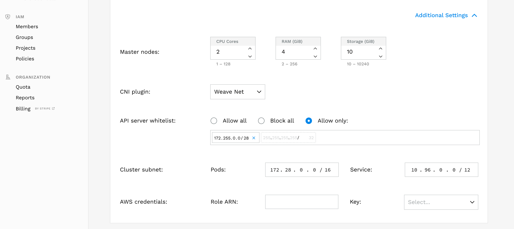

## AWS Credentials for Containers
Applications deployed on any Ridge cluster, can continue to use any AWS service, with no extra configuration.
This allows you to deploy applications that use AWS SDK without the need to handle complicated permission configuration - Ridge dynamically takes care of that.

In order to use this feature, you need to:
- Create and store a one-time AWS credentials using Ridge credentials vault.
Select the **Credentials Vault** -> **AWS** to manage AWS credentials. Ridge can use these to create temporary credentials for your containers. The AWS SDK that you install in your container will automatically locate these credentials. This will allow your containers to seamlessly access AWS services.

- provide AWS credentials to the containers in you cluster click **Additional Settings**. In the **AWS credentials** section set the following:
   - Enter the ARN of the role that you wish the containers to assume in the **Role ARN**
   - Select the AWS credentials to use for obtaining the temporary credentials from the dropdown list in the **key** parameter.

## Taints and Labels for Node Pools
To add kubernetes taints and labels to a node pool, click **Taints and Labels** in the node pool's section.
Labels are simply pairs of {key,value}. Select **Add Label** and set the **Key** abd **Value**.
A taint is a tuple of {key,value,effect}. To add a taint select **Add Taint**. Set the  **Key** abd **Value** and select the **Effect** from the dropdown menu.

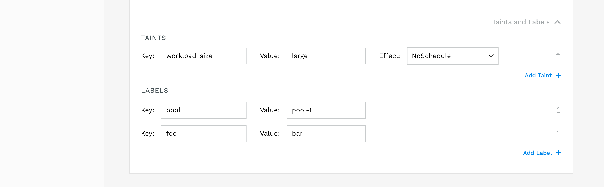
