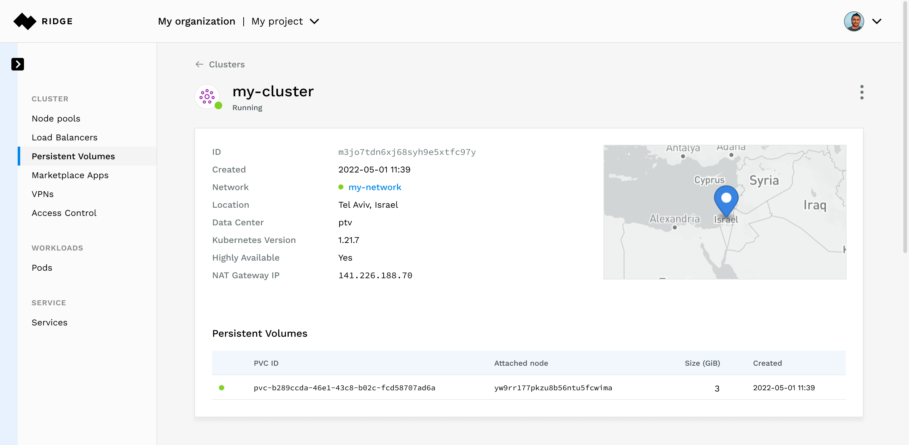
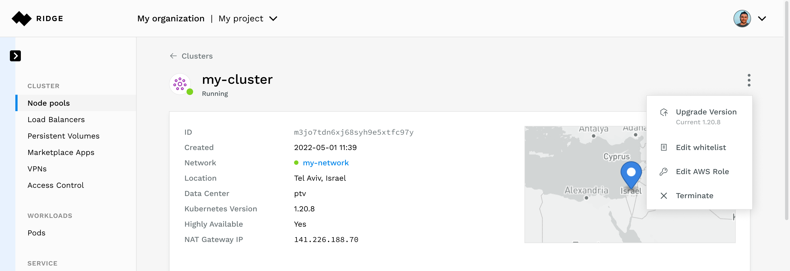
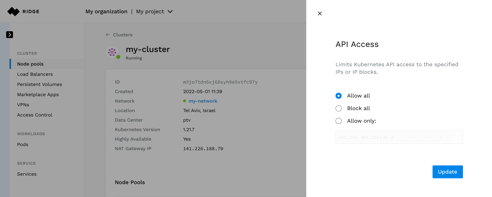
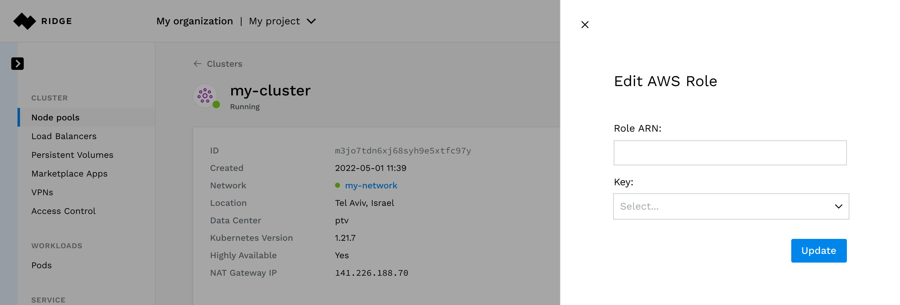
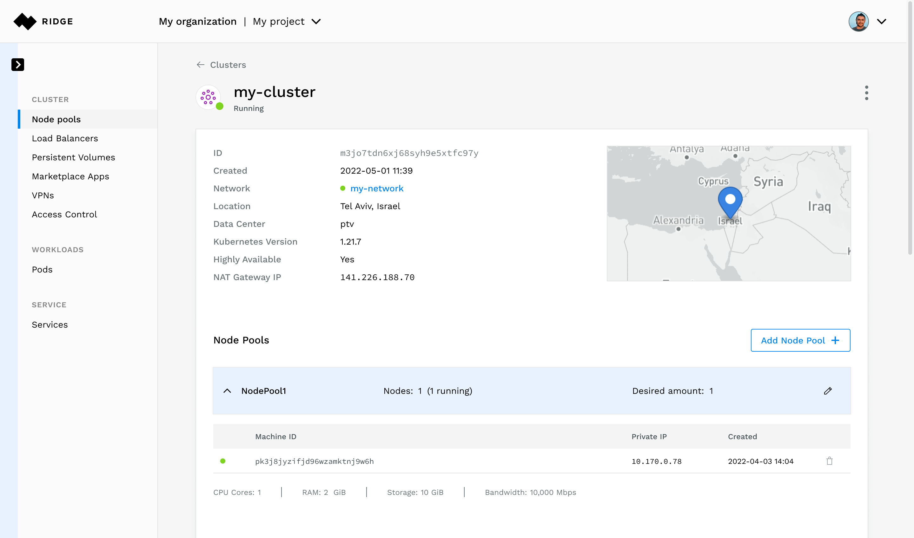
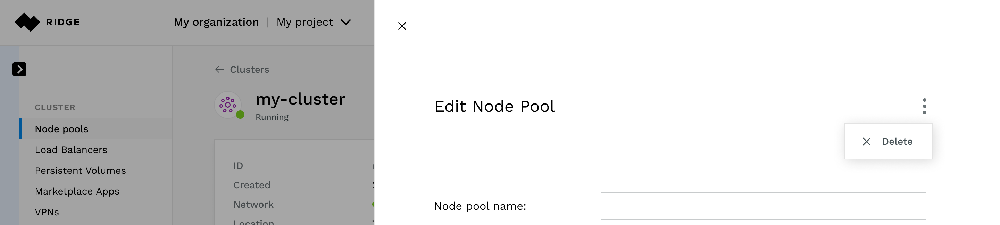
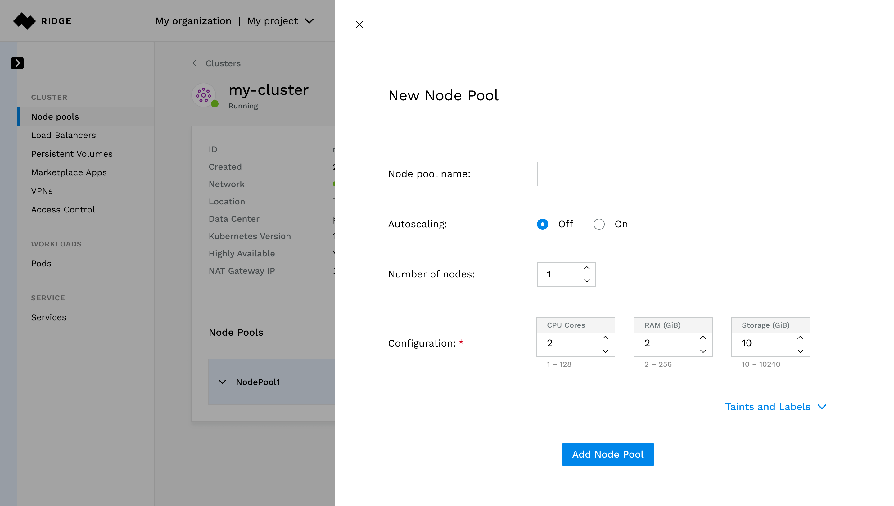

# Managing Your Cluster
Once a cluster is created, the console provides information about its status and resources and allows you to configure it:
 - update/create node pools
 - update/create Kubernetes API whitelist rules
 - update/create VPN access
 - update/create AWS permissions

**Note:** Across the UI, a pencil icon indicates that you can modify an entity and a trashcan  icon indicate that you can delete it from the console.

## Viewing Load Balancers
When you define a Kubernetes service whose type is "LoadBalancer" Ridge creates a load balancer in the data center, external to the Cluster.
The load balancer is automatically configured according to configuration defined in the cluster such as:
 - Ports and protocols
 - Health checks
 - White lists

You can view the cluster's load balancers on the **Load Balancers** tab of the cluster page.
Ridge continually maintains, provisions, and monitors the load balancer throughout the life of the `service`.

## Viewing Persistent Volumes
When you create a workload with a Persistent Volume Claim, Ridge creates a persistent volume, attaches the volume to the node and mounts the container to it.
Ridge continually maintains, provisions, and monitors the PV throughout the life of the `PVC`.

You can see the persistent volumes created for the cluster on the **Persistent Volumes** tab of the cluster page.

## Updating the cluster Properties

To edit a cluster, go to the **Cluster** page and open the menu in the top right corner.

- To initiate a Kubernetes version upgrade, select **Upgrade Version**.
  Ridge will upgrade all cluster nodes gracefully.
- To update the API whitelist, select **Edit Whitelist** and make the necessary changes.
  
- To change the AWS credentials, select **Edit AWS Creds** and modify the role ad/or select a different key
  

## Node Pools
### Updating a Node Pool
You can perform the following updates to a node pool:
- Edit the name
- Enable ot disable autoscaling
- Change the number of nodes or the minimal and/or maximal number of node
- Add or remove taints and labels.

**To edit a node pool:**
1. From the **Navigation** pane, click **Kubernetes**.
2. Select the Cluster you wish to edit.
3. Select the Node Pool you wish to edit.
   The **Edit Node Pool** dialog opens.
4. Make the modifications you desire
8. Click **Update Node Pool**.
   

### Deleting a Node
1. To delete a node, go to the **Cluster** page and select the **Node Pools** tab.
2. Select the node pool in which the node resides.
3. Click the trash can on the right-hand side.
   If necessary, Ridge will instruct Kubernetes to evict the node and delete it after it is evicted.
   

### Deleting a Node Pool
1. To delete a node pool, go to the **Cluster** page and select the **Node Pools** tab.
2. Select the node pool you wish to delete.
3. Click the edit icon.
4. Open the menu at the top right corner and click **Delete**.

### Adding a Node Pool
1. To add a node pool, go to the **Cluster** page and select the **Node Pools** tab.
2. Click **Add Node Pool**
3. Set the parameters
4. Click **Add Node Pool**.
5. See [Creating a node pool](###Creating-a-Node-Pool)

## Deleting a Cluster
To delete a cluster, select **Terminate** from the menu at the top right corner of the cluster's page.

