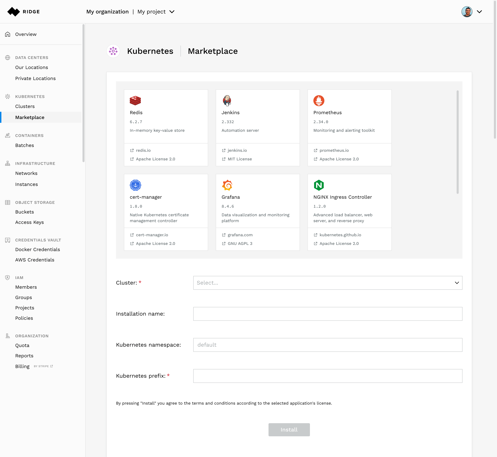
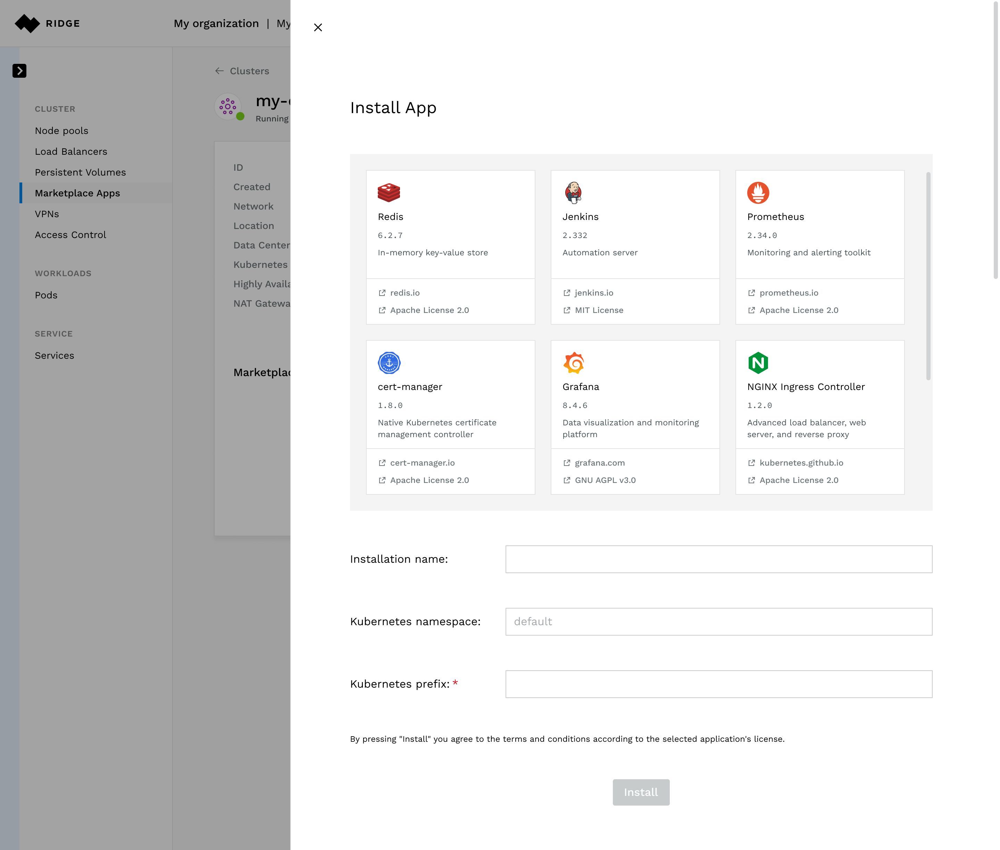
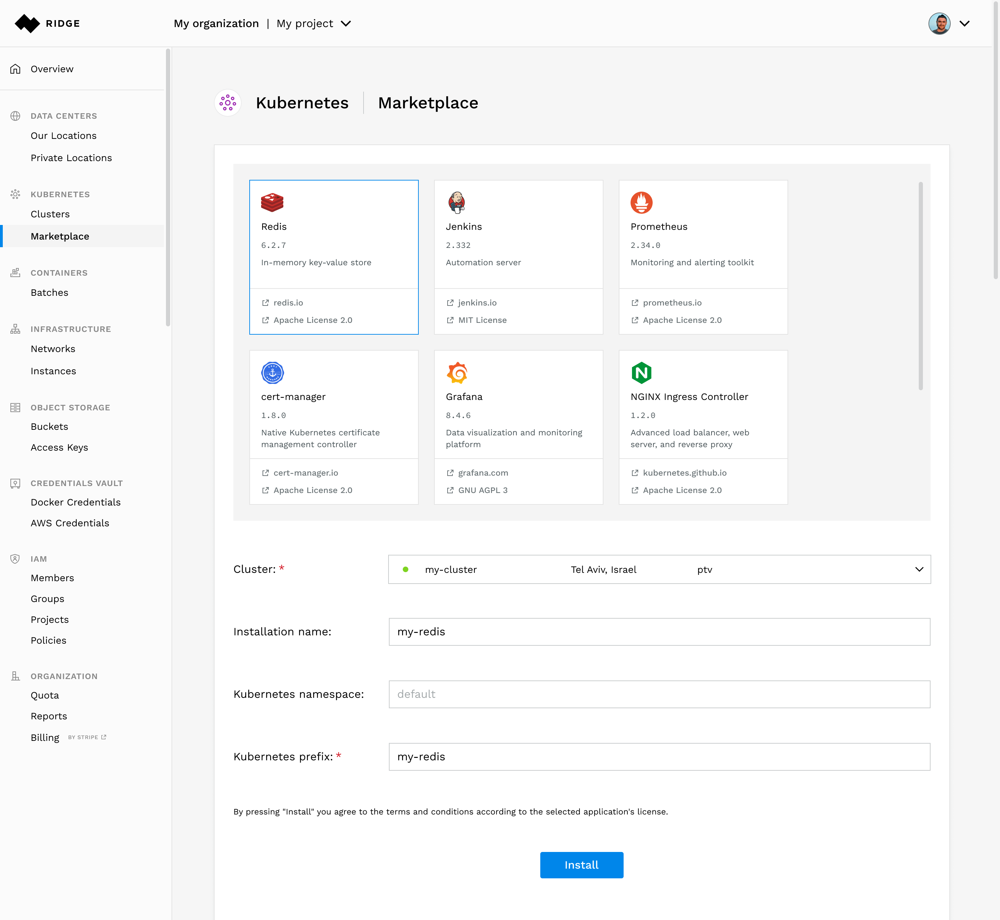
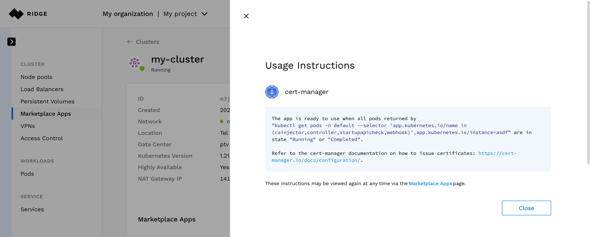

# Application marketplace
Using Ridge Application marketplace you can deploy a prepackaged applications from an application catalog on any Kubernetes cluster.

## Deploying an application
You can deploy an application in 2 ways:
 - Select _Marketplace_ under _Kubernetes_ side menu

 - Select a cluster to deploy the application on, press _Marketplace Apps_ and press _Install App_

In order to deploy an application you need to provide the following:
 - Cluster to deploy the application on (in case you are not in the cluster context)
 - Choose the application by selecting it from the catalog
 - _Installation name_ - the display name of the installation
 - _Kubernetes namespace_ - the namespace to install the app. if namespace does not exist, it will be created.
 - _Kubernetes prefix_ - used to allow deployment of multiple (identical) applications on the same namespace

Press Install to start the installation:
 - Specific user instruction will be displayed. can be opened at anytime, by pressing the _instructions_ button
 - Ridge will automate the deployment and show the application status

## Deleting an application

can be done by pressing the trash icon from the _Marketplace Apps` section of the cluster

__Note:__ namespaces created will not be deleted
