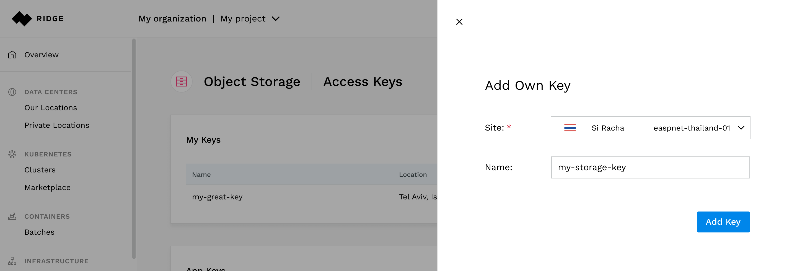
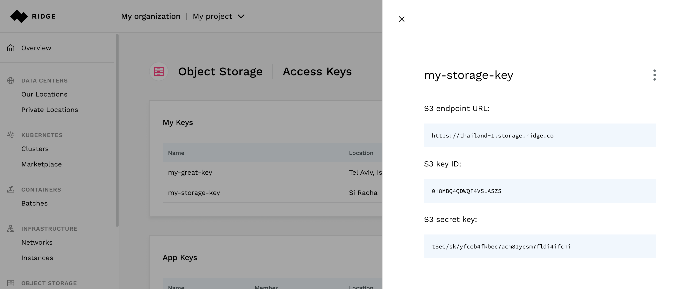
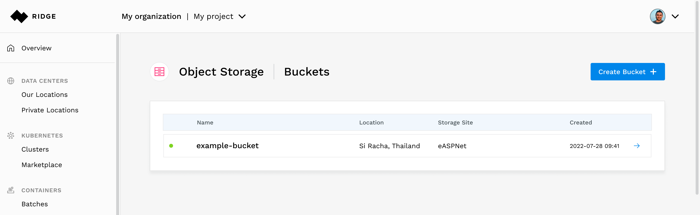
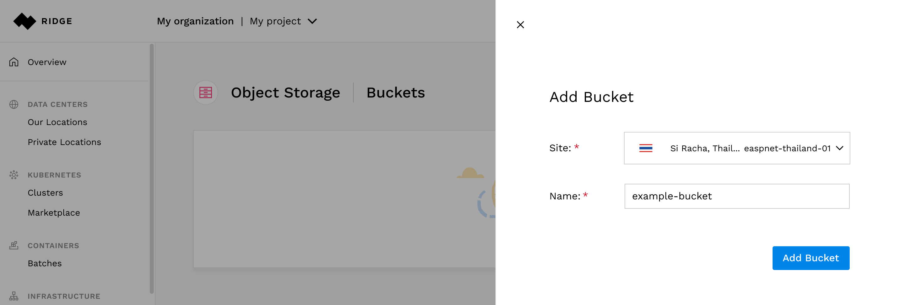

# Using the Ridge Object Storage Service
ROS can be managed with the S3 API.
This API requires keyed-HMAC based authentication.

This document will explain how to obtain these credentials, how to configure your S3 client and additional management tasks that can be performed from the Ridge console.

**Note:** Keys and Buckets are managed,like any other resource, in a context of a Project
## Obtaining Credentials
Start by selecting the project in which you wish to use ROS.
Selecting **Object Storage &#8702; Access Keys** in the left navigation pane.

There are two types of keys -
 - **My Keys** - keys that are associated with me (the user that is logged in)
 - **App Keys** - keys that are generated for an App member

Press the **Add Own Key** button to create your first key.
Select the ROS site that you wish to access and provide a meaningful name for the key. In this example we create an access key for the ROS site in Si Racha, Thailand and name it `my-first-storage-key`.

Press the **Add Key** button. A new pane will appear with the Access key ID and Secret access key. Copy these values and use them to configure your client (see section below).

## Managing Buckets in the Console

Select **Object Storage &#8702; Buckets**.
This page will show you a list of all the buckets that exist in this project.

**Note:**
You must have an access key to an ROS site in order to view the buckets of that site in the console.

Press the **Add Bucket** button.
Select the site in which you wish to create the bucket and provide a name for the bucket.
In this example we chose the Si Racha, Thailand site and named it `example-bucket`.

After you press the **Add Bucket** button, you will see all the details of the bucket, including its endpoint URL.

Adding Object to a bucket can be done using any S3 compatible tools.

Once you add objects to this bucket, you will be able to see them at the bottom of the bucket's page.
You may delete an object by pressing the trash icon on the far right.

To delete the bucket, press the three vertical dots in the upper right corner and select **Delete**.

## Configuring an S3 Client
There are only three parameters that you need to configure in your S3 client:

- The endpoint-url. In this example, this should be set to https://thailand-1.ros.rdgto.com
- The aws_access_key_id. This is the ID of your access key
- The aws_secret_access_key. This is the secret of your access key

Note that there is no need to configure the region.
